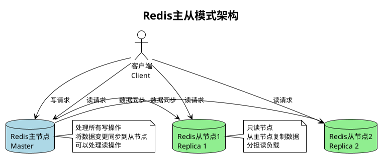
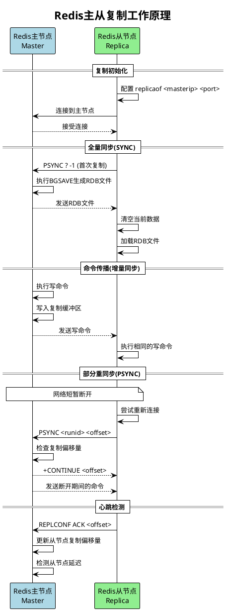
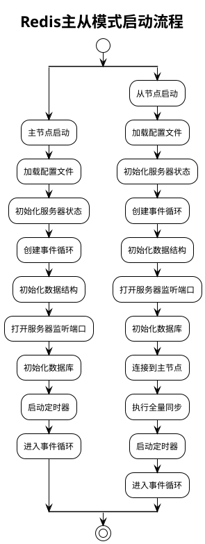
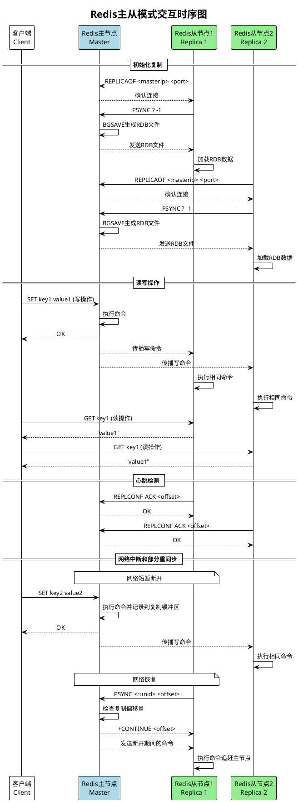

# Redis主从模式

Redis主从模式是一种基本的高可用配置，由一个主节点(Master)和一个或多个从节点(Replica/Slave)组成。主节点处理写操作并将数据变更同步到从节点，从节点主要处理读操作。

## 主从模式特点

- 数据冗余，提高数据安全性
- 读写分离，提高读取性能
- 主节点仍存在单点故障风险
- 不提供自动故障转移功能

## 主从模式架构



## 主从复制工作原理



## 主从模式启动流程



## 主从模式交互时序图



## 主从模式的优缺点

### 优点
1. **读写分离**：提高系统读取性能
2. **数据冗余**：多个副本提高数据安全性
3. **高可用基础**：为Sentinel和集群模式提供基础

### 缺点
1. **主节点单点故障**：主节点故障时无法自动切换
2. **写性能瓶颈**：所有写操作都集中在主节点
3. **全量复制开销**：新从节点加入或断开重连时可能需要全量复制
4. **复制延迟**：从节点数据可能落后于主节点

## 主从模式配置示例

### 主节点配置 (redis-master.conf)
```conf
port 6379
bind 0.0.0.0
daemonize yes
pidfile /var/run/redis_6379.pid
logfile /var/log/redis/redis_6379.log
dir /var/lib/redis
dbfilename dump_6379.rdb
appendonly yes
appendfilename "appendonly_6379.aof"
```

### 从节点配置 (redis-replica.conf)
```conf
port 6380
bind 0.0.0.0
daemonize yes
pidfile /var/run/redis_6380.pid
logfile /var/log/redis/redis_6380.log
dir /var/lib/redis
dbfilename dump_6380.rdb
appendonly yes
appendfilename "appendonly_6380.aof"
replicaof 127.0.0.1 6379  # 指定主节点
replica-read-only yes     # 从节点只读
```
