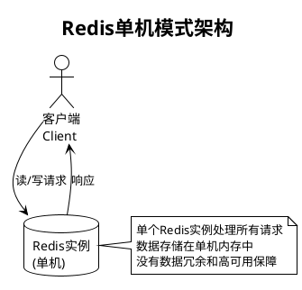
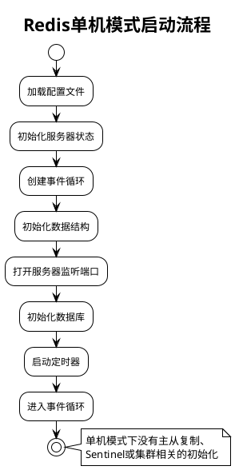
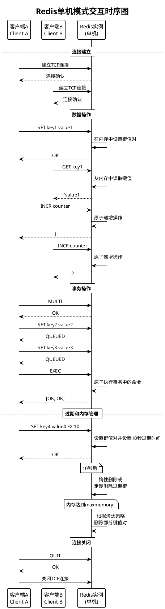

# Redis单机模式

Redis单机模式是最基本的部署方式，只有一个Redis实例提供所有服务。

## 单机模式特点

- 简单易用，配置简单
- 没有数据冗余，单点故障风险高
- 受限于单机内存和计算能力
- 适合开发环境或数据不敏感的场景

## 单机模式架构



## 单机模式启动流程



## 单机模式交互时序图



## 单机模式的局限性

1. **单点故障风险**：Redis实例崩溃或所在服务器故障会导致服务不可用
2. **容量限制**：受限于单台服务器的内存容量
3. **性能瓶颈**：单个实例的处理能力有限
4. **数据安全性低**：没有数据冗余，数据丢失风险高

## 单机模式适用场景

- 开发和测试环境
- 数据量较小且对可用性要求不高的应用
- 作为本地缓存使用
- 简单的队列或计数器应用

## 单机模式配置示例

```conf
# redis.conf 单机模式配置示例
port 6379
bind 127.0.0.1
daemonize yes
pidfile /var/run/redis.pid
logfile /var/log/redis.log
dir /var/lib/redis
dbfilename dump.rdb
appendonly yes
appendfilename "appendonly.aof"
```
