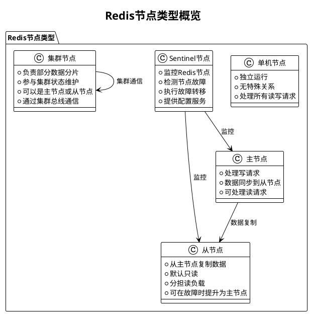
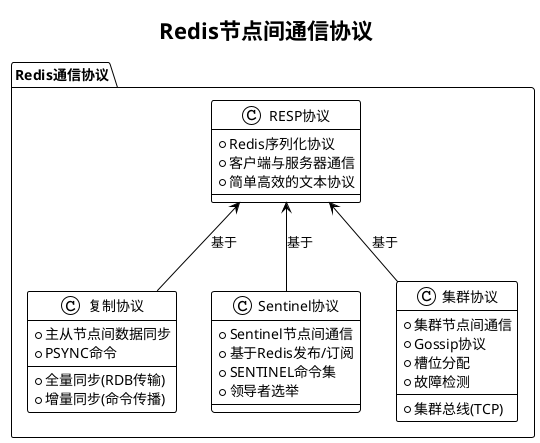
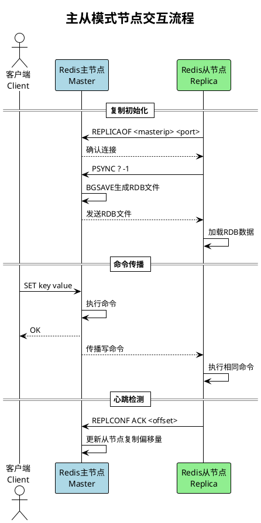
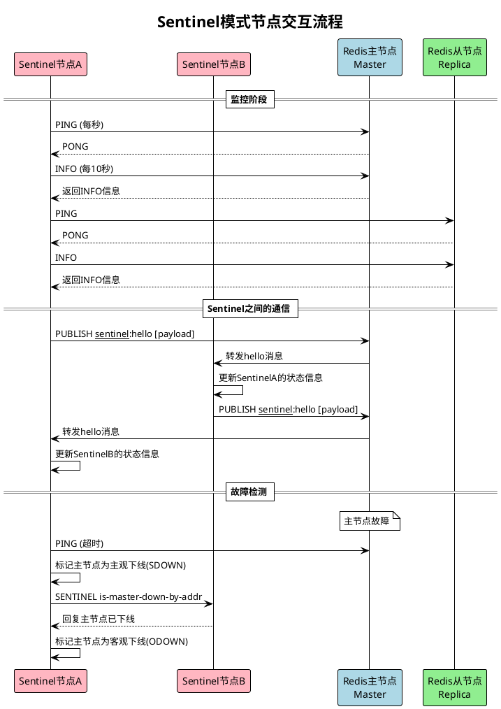
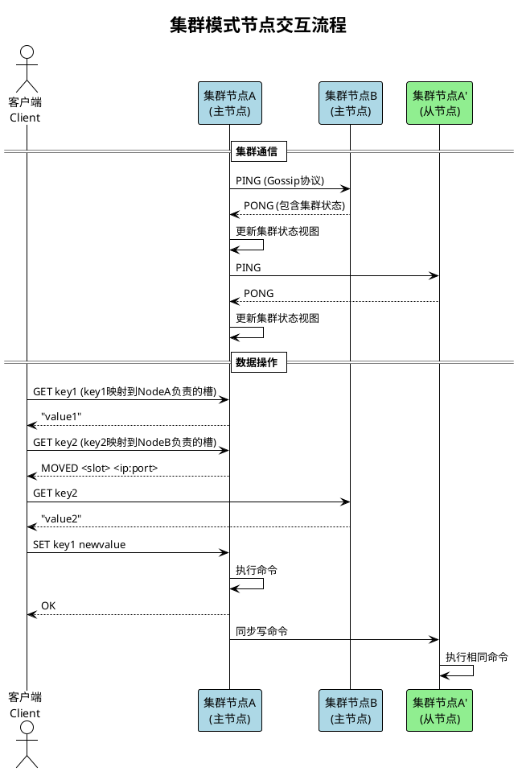
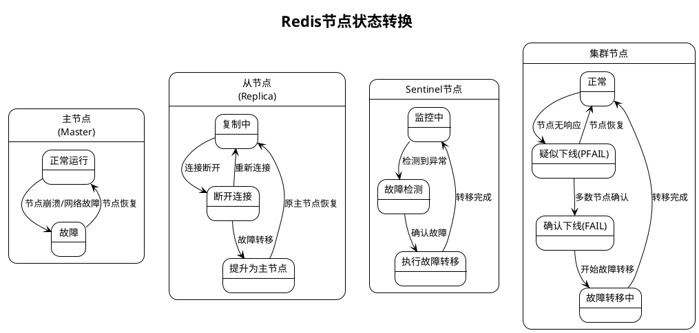

# Redis节点交互总结

Redis提供了多种部署模式，每种模式中节点之间的交互方式和关系各不相同。本文总结了Redis各种部署模式下的节点类型、关系和交互方式。

## Redis节点类型概览

## 各模式节点交互对比

| 特性 | 单机模式 | 主从模式 | Sentinel模式 | 集群模式 |
|------|---------|---------|------------|---------|
| 节点类型 | 单一Redis节点 | 主节点、从节点 | 主节点、从节点、Sentinel节点 | 集群主节点、集群从节点 |
| 数据分布 | 单节点存储全部数据 | 全节点存储全部数据 | 全节点存储全部数据 | 数据分片存储在多节点 |
| 节点通信 | 无 | 主从复制协议 | 主从复制协议、Sentinel协议 | 集群总线、主从复制协议 |
| 故障检测 | 无 | 无自动检测 | Sentinel主观/客观下线检测 | 集群PFAIL/FAIL机制 |
| 故障转移 | 无 | 无自动转移 | Sentinel自动选举和转移 | 集群自动选举和转移 |
| 客户端连接 | 直接连接 | 直接连接主/从 | 通过Sentinel获取主节点 | 连接任意节点，自动重定向 |

## 节点间通信协议

Redis节点间的通信使用多种协议，根据不同的部署模式和功能需求：

## 各模式下的节点交互流程

### 1. 主从模式交互流程

### 2. Sentinel模式交互流程

### 3. 集群模式交互流程

## 节点状态转换

Redis节点在不同模式下会经历不同的状态转换，特别是在故障检测和恢复过程中：

## 总结

Redis提供了多种部署模式，从简单的单机模式到复杂的集群模式，以满足不同的可用性、可扩展性和性能需求。各种模式下的节点交互方式各不相同：

1. **单机模式**：最简单的部署方式，无节点间交互
2. **主从模式**：通过复制协议实现数据同步，提高读性能和数据安全性
3. **Sentinel模式**：在主从基础上增加Sentinel节点，通过监控和自动故障转移提高可用性
4. **集群模式**：通过数据分片和集群协议实现水平扩展，同时提供高可用性

了解这些不同模式下的节点交互方式，有助于更好地设计、部署和维护Redis系统，根据实际需求选择合适的部署模式。
