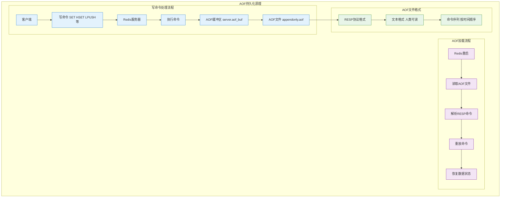
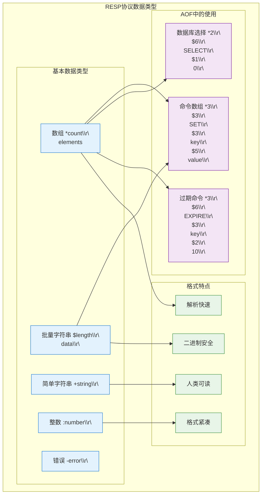
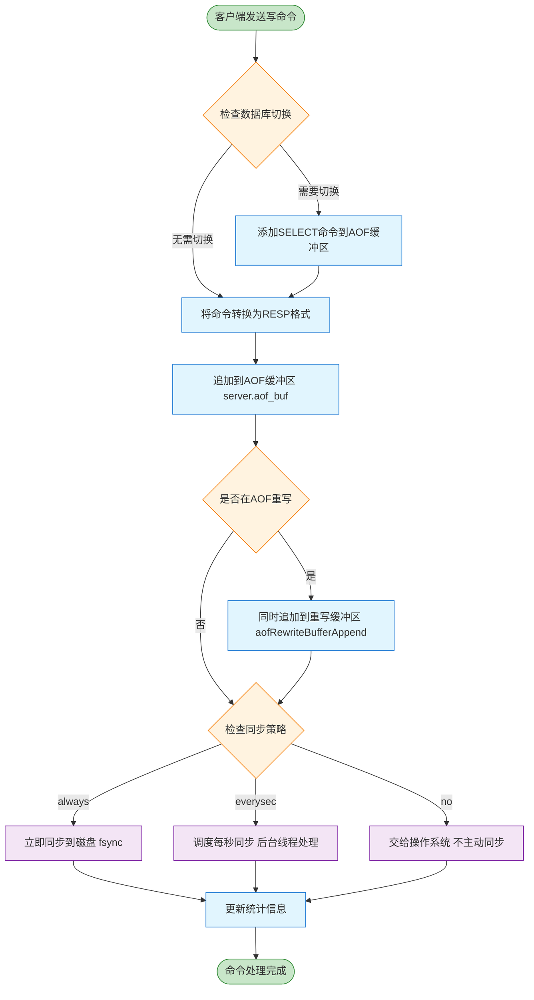
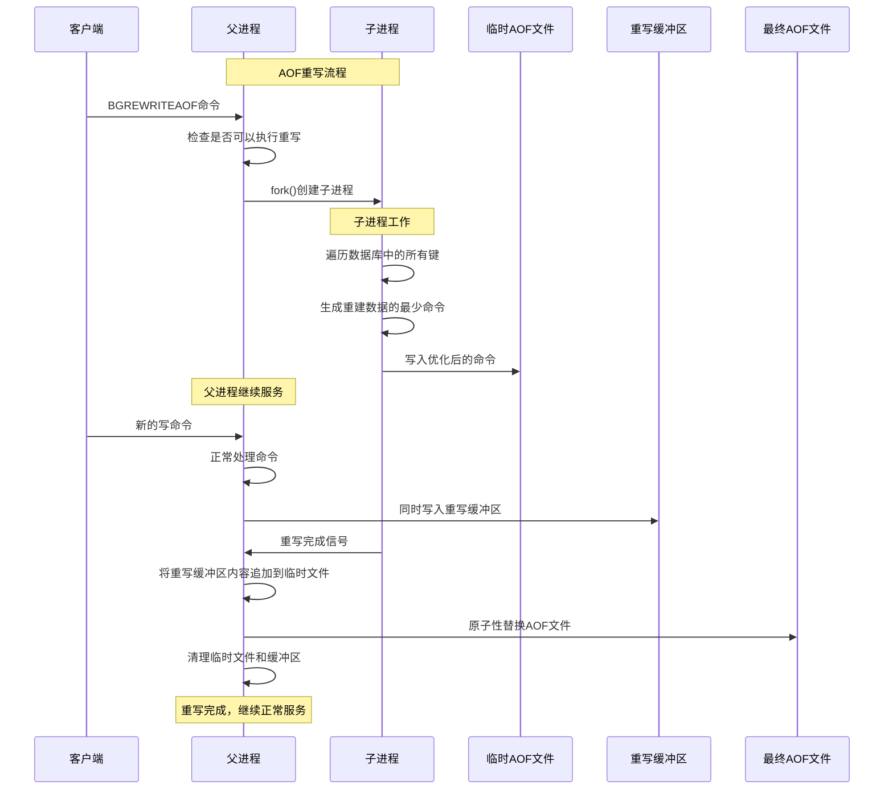
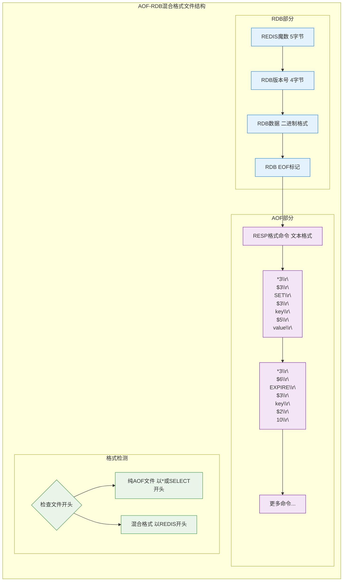
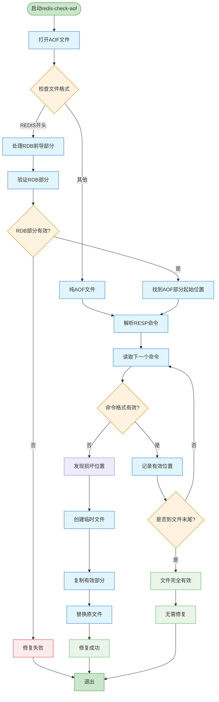
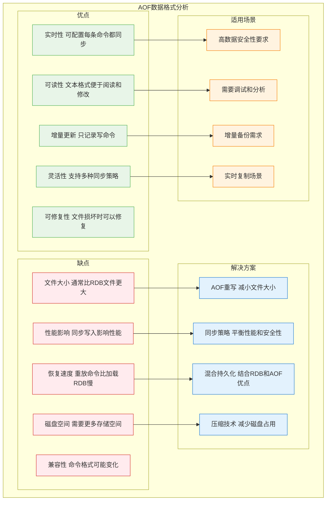

# Redis AOF 数据格式详解

AOF (Append Only File) 是 Redis 的持久化机制之一，它通过记录服务器执行的所有写命令来实现数据持久化。本文将详细分析 AOF 的数据格式及其管理机制。

## 1. AOF 基本原理

AOF 持久化的核心思想是记录修改数据库的写命令，而不是数据本身。当 Redis 重启时，它会重新执行 AOF 文件中的命令来重建数据库状态。



```c
// 在 aof.c 中
void feedAppendOnlyFile(struct redisCommand *cmd, int dictid, robj **argv, int argc) {
    sds buf = sdsempty();
    
    // 如果需要切换数据库，添加 SELECT 命令
    if (dictid != server.aof_selected_db) {
        char seldb[64];
        snprintf(seldb, sizeof(seldb), "*2\r\n$6\r\nSELECT\r\n$%d\r\n%d\r\n",
            (int)ll2string(seldb+30,sizeof(seldb)-30,(long)dictid), dictid);
        buf = sdscat(buf, seldb);
        server.aof_selected_db = dictid;
    }
    
    // 将命令转换为 RESP 格式
    buf = catAppendOnlyGenericCommand(buf, argc, argv);
    
    // 将命令追加到 AOF 缓冲区
    if (server.aof_state == AOF_ON)
        server.aof_buf = sdscatlen(server.aof_buf, buf, sdslen(buf));
    
    // 如果开启了 AOF 重写，也将命令追加到 AOF 重写缓冲区
    if (server.aof_child_pid != -1)
        aofRewriteBufferAppend((unsigned char*)buf, sdslen(buf));
    
    sdsfree(buf);
}
```

## 2. AOF 文件格式详解

### 2.1 RESP 协议格式

AOF 文件使用 Redis 序列化协议 (RESP - Redis Serialization Protocol) 来存储命令。RESP 是一种二进制安全的文本协议，具有以下特点：

1. **简单**：易于实现和解析
2. **高效**：解析速度快，内存占用小
3. **人类可读**：格式清晰，便于调试

### 2.2 基本数据类型

RESP 协议定义了几种基本数据类型，在 AOF 文件中主要使用以下类型：



#### 2.2.1 简单字符串

格式：`+<string>\r\n`

例如：`+OK\r\n`

#### 2.2.2 错误

格式：`-<error message>\r\n`

例如：`-ERR unknown command 'foobar'\r\n`

#### 2.2.3 整数

格式：`:<number>\r\n`

例如：`:1000\r\n`

#### 2.2.4 批量字符串

格式：`$<length>\r\n<data>\r\n`

例如：`$5\r\nhello\r\n`

#### 2.2.5 数组

格式：`*<number of elements>\r\n<element1><element2>...<elementN>`

例如：`*2\r\n$5\r\nhello\r\n$5\r\nworld\r\n`

### 2.3 命令格式

在 AOF 文件中，每个 Redis 命令都被编码为 RESP 数组，其中第一个元素是命令名称，后续元素是命令参数：

```
*<命令参数数量+1>\r\n
$<命令名称长度>\r\n
<命令名称>\r\n
$<参数1长度>\r\n
<参数1>\r\n
$<参数2长度>\r\n
<参数2>\r\n
...
```

### 2.4 实际示例

以下是一些常见 Redis 命令在 AOF 文件中的格式：

#### 2.4.1 SET 命令

```
*3\r\n$3\r\nSET\r\n$3\r\nkey\r\n$5\r\nvalue\r\n
```

这表示 `SET key value` 命令，解析如下：
- `*3\r\n`：数组有 3 个元素
- `$3\r\nSET\r\n`：第一个元素是长度为 3 的字符串 "SET"
- `$3\r\nkey\r\n`：第二个元素是长度为 3 的字符串 "key"
- `$5\r\nvalue\r\n`：第三个元素是长度为 5 的字符串 "value"

#### 2.4.2 SELECT 命令

```
*2\r\n$6\r\nSELECT\r\n$1\r\n0\r\n
```

这表示 `SELECT 0` 命令，用于切换到数据库 0。

#### 2.4.3 HSET 命令

```
*4\r\n$4\r\nHSET\r\n$4\r\nhash\r\n$5\r\nfield\r\n$5\r\nvalue\r\n
```

这表示 `HSET hash field value` 命令。

#### 2.4.4 带过期时间的命令

对于设置了过期时间的键，AOF 文件会包含两个命令：一个设置值的命令和一个设置过期时间的命令：

```
*3\r\n$3\r\nSET\r\n$3\r\nkey\r\n$5\r\nvalue\r\n
*3\r\n$6\r\nEXPIRE\r\n$3\r\nkey\r\n$2\r\n10\r\n
```

这表示 `SET key value` 和 `EXPIRE key 10` 两个命令。

### 2.5 多数据库支持

Redis 支持多个数据库（默认 16 个，编号从 0 到 15）。在 AOF 文件中，当操作切换到不同的数据库时，会先写入 SELECT 命令：

```
*2\r\n$6\r\nSELECT\r\n$1\r\n0\r\n
*3\r\n$3\r\nSET\r\n$3\r\nkey\r\n$5\r\nvalue\r\n
*2\r\n$6\r\nSELECT\r\n$1\r\n1\r\n
*3\r\n$3\r\nSET\r\n$6\r\nanother\r\n$5\r\nvalue\r\n
```

这表示在数据库 0 中执行 `SET key value`，然后切换到数据库 1 执行 `SET another value`。

## 3. AOF 文件生成过程



### 3.1 命令追加

当 Redis 执行写命令时，会将命令追加到 AOF 缓冲区：

```c
// 在 aof.c 中
void feedAppendOnlyFile(struct redisCommand *cmd, int dictid, robj **argv, int argc) {
    // ... 代码见上文 ...
}
```

### 3.2 AOF重写机制

AOF重写是Redis优化AOF文件大小的重要机制：



### 3.3 缓冲区刷新

根据配置的同步策略，Redis 会定期将 AOF 缓冲区的内容写入磁盘：

```c
// 在 aof.c 中
void flushAppendOnlyFile(int force) {
    ssize_t nwritten;
    int sync_in_progress = 0;
    
    // 如果 AOF 缓冲区为空，无需刷新
    if (sdslen(server.aof_buf) == 0) return;
    
    // 如果 AOF 文件描述符无效，尝试打开
    if (server.aof_fd == -1) {
        // ... 打开 AOF 文件 ...
    }
    
    // 将 AOF 缓冲区内容写入文件
    nwritten = write(server.aof_fd, server.aof_buf, sdslen(server.aof_buf));
    if (nwritten != (ssize_t)sdslen(server.aof_buf)) {
        // ... 处理写入错误 ...
    }
    
    // 更新统计信息
    server.aof_current_size += nwritten;
    
    // 清空 AOF 缓冲区
    sdsclear(server.aof_buf);
    
    // 根据同步策略执行 fsync
    if (server.aof_fsync == AOF_FSYNC_ALWAYS) {
        // 立即同步
        redis_fsync(server.aof_fd);
    } else if (server.aof_fsync == AOF_FSYNC_EVERYSEC && !force) {
        // 每秒同步一次
        // ... 代码见上文 ...
    }
    
    // ... 其他代码 ...
}
```

## 4. AOF-RDB 混合格式

从 Redis 4.0 开始，引入了 AOF-RDB 混合持久化模式。在这种模式下，AOF 文件的格式变得更加复杂，包含两部分：



### 4.1 RDB 部分

文件开头是一个完整的 RDB 文件，包含重写时的数据库状态：

```
REDIS0009\xFA\x00\x00\x00\x00\x00\x00\x00\x00...
```

这部分使用二进制 RDB 格式，以 "REDIS" 魔数开头，后跟版本号和数据内容。

### 4.2 AOF 部分

RDB 部分之后是标准的 AOF 格式命令，记录了 RDB 快照之后的所有写操作：

```
*3\r\n$3\r\nSET\r\n$3\r\nkey\r\n$5\r\nvalue\r\n
*3\r\n$6\r\nEXPIRE\r\n$3\r\nkey\r\n$2\r\n10\r\n
```

### 4.3 格式标识

为了区分是纯 AOF 文件还是混合格式，Redis 在文件开头使用不同的标识：

- 纯 AOF 文件：以 `*` 或 `SELECT` 命令开头
- 混合格式：以 `REDIS` 魔数开头（RDB 文件的特征）

```c
// 在 aof.c 中
int checkAofFileExistsAndNoRdbPreamble(void) {
    FILE *fp;
    char buf[4];
    int res = 0;
    
    if ((fp = fopen(server.aof_filename, "r")) != NULL) {
        if (fread(buf, 1, 4, fp) == 4 && memcmp(buf, "REDIS", 4) != 0) {
            // 文件存在且不是以 "REDIS" 开头，说明是纯 AOF 文件
            res = 1;
        }
        fclose(fp);
    }
    return res;
}
```

## 5. AOF 文件修复

由于 AOF 文件是文本格式，且每个命令都是完整的 RESP 格式，因此当 AOF 文件尾部损坏时，可以使用 `redis-check-aof` 工具进行修复：



```c
// 在 redis-check-aof.c 中
int fixAof(char *filename) {
    char buf[4096];
    unsigned char sig[5];
    long long read_bytes = 0;
    int ret = 0;
    
    // 打开原始 AOF 文件
    FILE *fp = fopen(filename, "r+");
    if (!fp) {
        printf("Cannot open %s: %s\n", filename, strerror(errno));
        return 1;
    }
    
    // 检查文件是否为 RDB 格式
    if (fread(sig, 1, 5, fp) != 5 || memcmp(sig, "REDIS", 5) == 0) {
        // 文件是 RDB 格式或太短
        printf("The AOF appears to start with an RDB preamble.\n");
        printf("Checking the RDB preamble to start:\n");
        ret = redis_check_rdb_main(filename, fp);
        if (ret == 0) {
            printf("RDB preamble is OK, proceeding with AOF tail...\n");
            read_bytes = ftello(fp);
        } else {
            printf("RDB preamble not OK, aborting...\n");
            fclose(fp);
            return 1;
        }
    } else {
        rewind(fp);
    }
    
    // 创建临时文件
    char tmpfile[256];
    snprintf(tmpfile, sizeof(tmpfile), "tmp-aof-%d.aof", (int)getpid());
    FILE *fpout = fopen(tmpfile, "w");
    if (!fpout) {
        printf("Cannot open %s for writing: %s\n", tmpfile, strerror(errno));
        fclose(fp);
        return 1;
    }
    
    // 复制有效部分
    while(1) {
        size_t nread = fread(buf, 1, sizeof(buf), fp);
        if (nread <= 0) break;
        read_bytes += nread;
        if (fwrite(buf, 1, nread, fpout) != nread) {
            printf("Write error writing to %s: %s\n", tmpfile, strerror(errno));
            ret = 1;
            break;
        }
    }
    
    // 关闭文件
    fclose(fp);
    fclose(fpout);
    
    // 如果修复成功，替换原文件
    if (ret == 0) {
        if (rename(tmpfile, filename) == -1) {
            printf("Error renaming %s to %s: %s\n", tmpfile, filename, strerror(errno));
            ret = 1;
        }
    } else {
        unlink(tmpfile);
    }
    
    return ret;
}
```

`redis-check-aof` 工具会逐行解析 AOF 文件，找到最后一个有效的 Redis 命令，然后截断文件，删除损坏的部分。

## 6. AOF 数据格式的优缺点



### 6.1 优点

1. **可读性**：AOF 文件使用文本格式，便于人类阅读和修改。
2. **增量更新**：只记录写命令，文件增长与写操作数量成正比。
3. **可修复性**：文件尾部损坏时可以修复。
4. **实时性**：可以配置为每条命令都同步到磁盘，最大限度减少数据丢失。

### 6.2 缺点

1. **文件大小**：相比 RDB，AOF 文件通常更大。
2. **性能影响**：同步写入磁盘会影响性能。
3. **恢复速度**：相比加载 RDB 文件，重放 AOF 文件通常更慢。
4. **兼容性**：命令格式可能随 Redis 版本变化而变化。

## 7. 总结

Redis AOF 文件使用 RESP 协议格式存储执行过的写命令，通过重放这些命令来恢复数据库状态。它支持多种同步策略，可以根据需要平衡数据安全性和性能。从 Redis 4.0 开始，混合持久化模式结合了 RDB 和 AOF 的优点，提供了更好的性能和数据安全性。

AOF 的文本格式使其具有良好的可读性和可修复性，但也导致文件较大和恢复较慢。在实际应用中，应根据数据重要性和性能需求选择合适的持久化策略。
