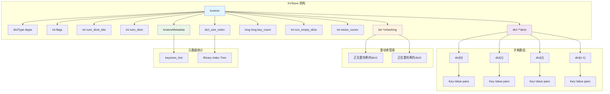
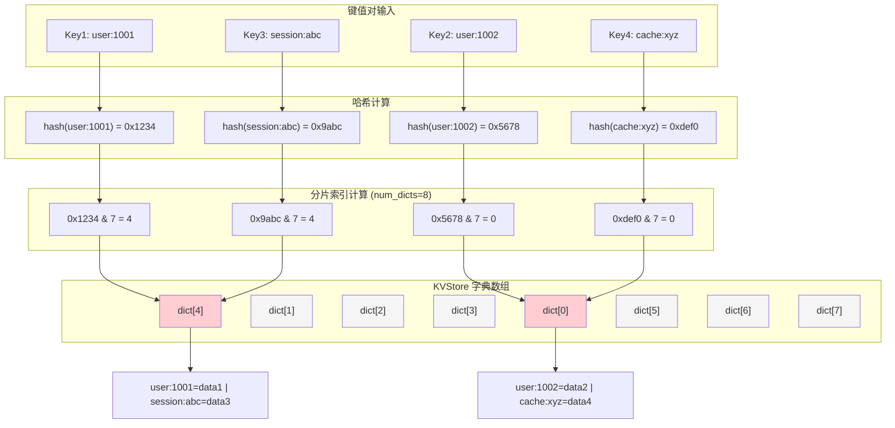
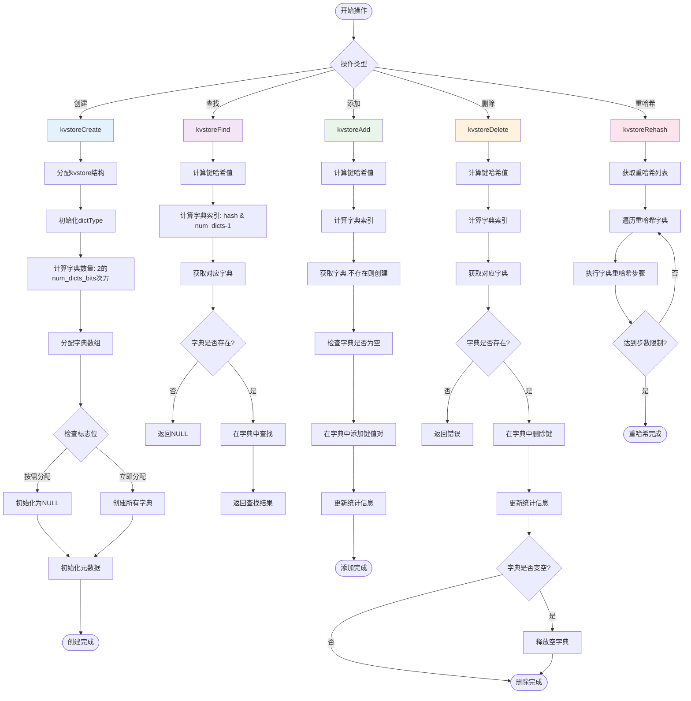
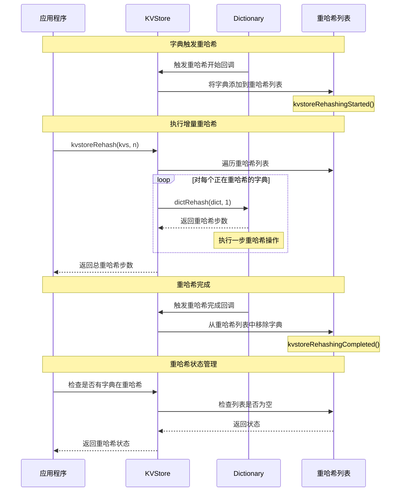
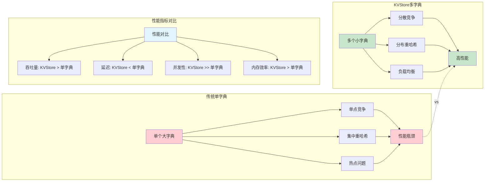
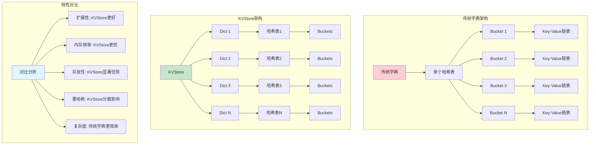

# Redis KVStore 数据存储机制分析

KVStore 是 Redis 7.0 引入的一种新的数据存储机制，用于优化大规模键值存储的性能和内存使用。本文将详细分析 KVStore 的数据存储原理和实现机制。

## 1. KVStore 的基本结构

KVStore 本质上是一个字典数组（array of dictionaries）的封装，其核心数据结构如下：

```c
typedef struct kvstore {
    dictType dtype;                /* 字典类型，包含各种回调函数 */
    int flags;                     /* KVStore 的标志位 */
    int num_dicts_bits;            /* 字典数量的对数值 */
    int num_dicts;                 /* 字典的数量 */
    dict **dicts;                  /* 字典数组 */
    list *rehashing;               /* 正在重哈希的字典列表 */
    long long key_count;           /* 存储的键总数 */
    int non_empty_dicts;           /* 非空字典的数量 */
    int resize_cursor;             /* 用于调整大小的游标 */
    unsigned long long *dict_size_index; /* 字典大小索引 */
    long long bucket_count;        /* 桶的总数 */
    long long overhead_hashtable_lut; /* 哈希表查找表的开销 */
    long long overhead_hashtable_rehashing; /* 重哈希的开销 */
    /* 可能还有元数据结构 */
} kvstore;
```

### 1.1 KVStore 整体架构图



## 2. KVStore 的存储原理

### 2.1 分片存储

KVStore 采用分片存储策略，将数据分散存储在多个字典中：

1. **字典数量计算**：
   - 字典数量由 `num_dicts_bits` 决定，实际数量为 `2^num_dicts_bits`
   - 例如，如果 `num_dicts_bits` 为 3，则会创建 8 个字典
   - 这种设计使得字典数量总是 2 的幂，便于哈希计算

2. **键的分布算法**：
   - 键通过哈希函数分配到不同的字典中
   - 通常使用键的哈希值对字典数量取模来确定存储位置
   - 伪代码如下：
     ```c
     dict_index = hash(key) & (num_dicts - 1);
     ```
   - 由于 `num_dicts` 是 2 的幂，所以 `& (num_dicts - 1)` 等价于 `% num_dicts`，但性能更好

3. **分片的好处**：
   - 减少单个字典的大小，降低哈希冲突概率
   - 分散重哈希的压力，避免单个大字典重哈希导致的性能抖动
   - 便于并行操作，提高多核利用率

#### 2.1.1 分片存储示意图



### 2.2 按需分配

KVStore 支持按需分配字典，以节省内存：

```c
/* 获取指定索引的字典 */
dict *kvstoreGetDict(kvstore *kvs, unsigned int idx, int create_if_missing) {
    if (idx >= kvs->num_dicts) return NULL;
    
    // 如果字典不存在且需要创建
    if (kvs->dicts[idx] == NULL && create_if_missing) {
        kvs->dicts[idx] = dictCreate(&kvs->dtype, NULL);
        // 可能还有其他初始化操作
    }
    
    return kvs->dicts[idx];
}
```

如果设置了 `KVSTORE_ALLOCATE_DICTS_ON_DEMAND` 标志，字典会在需要时才创建，这可以节省内存，特别是在键分布不均匀的情况下。

### 2.3 重哈希管理

KVStore 维护一个 `rehashing` 列表，跟踪正在重哈希的字典：

```c
/* 开始重哈希回调 */
void kvstoreRehashingStarted(dict *d) {
    kvstore *kvs = dictGetUserData(d);
    listAddNodeTail(kvs->rehashing, d);
}

/* 完成重哈希回调 */
void kvstoreRehashingCompleted(dict *d) {
    kvstore *kvs = dictGetUserData(d);
    listNode *ln = listSearchKey(kvs->rehashing, d);
    if (ln) listDelNode(kvs->rehashing, ln);
}
```

这种设计使得 KVStore 可以跟踪和管理所有正在进行重哈希的字典，便于控制重哈希的进度和资源使用。

## 3. KVStore 的核心操作

### 3.1 KVStore 操作流程图



### 3.2 创建 KVStore

```c
/* 创建 KVStore */
kvstore *kvstoreCreate(dictType *dtype, int num_dicts_bits, int flags) {
    kvstore *kvs;
    int j;
    
    // 检查参数
    if (num_dicts_bits > 16) return NULL; // 最多支持 2^16 个字典
    
    // 分配 KVStore 结构
    kvs = zmalloc(sizeof(*kvs));
    
    // 初始化字典类型
    kvs->dtype = *dtype;
    if (dtype->rehashingStarted == NULL)
        kvs->dtype.rehashingStarted = kvstoreRehashingStarted;
    if (dtype->rehashingCompleted == NULL)
        kvs->dtype.rehashingCompleted = kvstoreRehashingCompleted;
    
    // 设置用户数据为 KVStore 自身，用于回调
    kvs->dtype.userdata = kvs;
    
    // 初始化其他字段
    kvs->flags = flags;
    kvs->num_dicts_bits = num_dicts_bits;
    kvs->num_dicts = 1 << num_dicts_bits;
    kvs->dicts = zmalloc(sizeof(dict*) * kvs->num_dicts);
    kvs->rehashing = listCreate();
    kvs->key_count = 0;
    kvs->non_empty_dicts = 0;
    kvs->resize_cursor = 0;
    
    // 根据标志决定是否立即分配所有字典
    if (flags & KVSTORE_ALLOCATE_DICTS_ON_DEMAND) {
        // 按需分配，初始化为 NULL
        memset(kvs->dicts, 0, sizeof(dict*) * kvs->num_dicts);
    } else {
        // 立即分配所有字典
        for (j = 0; j < kvs->num_dicts; j++) {
            kvs->dicts[j] = dictCreate(&kvs->dtype, NULL);
        }
    }
    
    // 分配元数据结构（如果需要）
    if (flags & KVSTORE_ALLOC_META_KEYS_HIST) {
        // ... 分配元数据结构 ...
    }
    
    return kvs;
}
```

### 3.2 查找键

```c
/* 查找键 */
void *kvstoreFind(kvstore *kvs, void *key) {
    unsigned int hash = kvs->dtype.hashFunction(key);
    unsigned int idx = hash & (kvs->num_dicts - 1);
    dict *d = kvs->dicts[idx];
    
    // 如果字典不存在，则键不存在
    if (d == NULL) return NULL;
    
    // 在字典中查找键
    dictEntry *de = dictFind(d, key);
    return de ? dictGetVal(de) : NULL;
}
```

### 3.3 添加键值对

```c
/* 添加键值对 */
int kvstoreAdd(kvstore *kvs, void *key, void *val) {
    unsigned int hash = kvs->dtype.hashFunction(key);
    unsigned int idx = hash & (kvs->num_dicts - 1);
    dict *d = kvstoreGetDict(kvs, idx, 1); // 获取字典，如果不存在则创建
    
    // 检查字典是否为空
    int was_empty = dictSize(d) == 0;
    
    // 添加键值对
    int ret = dictAdd(d, key, val);
    
    // 更新统计信息
    if (ret == DICT_OK) {
        kvs->key_count++;
        if (was_empty) kvs->non_empty_dicts++;
    }
    
    return ret;
}
```

### 3.4 删除键

```c
/* 删除键 */
int kvstoreDelete(kvstore *kvs, void *key) {
    unsigned int hash = kvs->dtype.hashFunction(key);
    unsigned int idx = hash & (kvs->num_dicts - 1);
    dict *d = kvs->dicts[idx];
    
    // 如果字典不存在，则键不存在
    if (d == NULL) return DICT_ERR;
    
    // 检查字典大小
    int size_before = dictSize(d);
    
    // 删除键
    int ret = dictDelete(d, key);
    
    // 更新统计信息
    if (ret == DICT_OK) {
        kvs->key_count--;
        if (size_before == 1) kvs->non_empty_dicts--;
    }
    
    return ret;
}
```

### 3.5 重哈希操作

```c
/* 执行增量重哈希 */
int kvstoreRehash(kvstore *kvs, int n) {
    int rehashes = 0;

    // 遍历正在重哈希的字典列表
    listIter li;
    listNode *ln;
    listRewind(kvs->rehashing, &li);

    while ((ln = listNext(&li)) && rehashes < n) {
        dict *d = listNodeValue(ln);
        rehashes += dictRehash(d, 1); // 执行一步重哈希
    }

    return rehashes;
}
```

#### 3.5.1 重哈希管理机制



## 4. KVStore 的优势

### 4.1 内存效率

KVStore 通过分片和按需分配机制提高了内存效率：

1. **减少内存碎片**：
   - 多个小字典比一个大字典产生的内存碎片更少
   - 按需分配避免了为空闲分片分配内存

2. **更灵活的内存使用**：
   - 可以根据实际需求动态调整字典大小
   - 不同分片可以有不同的负载因子

3. **元数据统计**：
   - 如果启用了元数据收集，可以获得键分布的详细统计信息
   - 这有助于优化内存使用和性能

### 4.2 性能优势

KVStore 在性能方面有多项优势：

1. **并行操作**：
   - 不同字典的操作可以并行化，减少锁竞争
   - 特别适合多核环境

2. **分散重哈希压力**：
   - 重哈希过程分散到多个小字典，而不是一次性重哈希一个大字典
   - 这减少了重哈希对整体性能的影响

3. **更好的缓存局部性**：
   - 小字典更容易完全缓存在 CPU 缓存中
   - 这提高了访问频繁键的性能

4. **更均衡的负载**：
   - 通过哈希分布，键值对更均匀地分布在多个字典中
   - 这减少了热点问题

#### 4.2.1 性能优势对比图



### 4.3 扩展性

KVStore 设计具有良好的扩展性：

1. **水平扩展**：
   - 可以通过增加字典数量来扩展容量
   - 支持动态调整字典数量（虽然需要重新分布键）

2. **功能扩展**：
   - 通过回调函数机制，可以轻松添加新功能
   - 例如，可以添加自定义的重哈希策略或监控功能

3. **适应不同场景**：
   - 通过调整参数和标志，可以针对不同场景优化
   - 例如，内存受限场景可以使用按需分配，高性能场景可以预分配所有字典

## 5. KVStore 的使用场景

KVStore 主要用于 Redis 内部的大规模键值存储，特别适合以下场景：

### 5.1 大型哈希表

当哈希表包含大量键值对时，使用 KVStore 可以显著提高性能和内存效率：

```c
// 示例：使用 KVStore 存储大型哈希表
kvstore *large_hash = kvstoreCreate(&hashDictType, 8, KVSTORE_ALLOCATE_DICTS_ON_DEMAND);
// 这将创建一个有 256 (2^8) 个分片的 KVStore
```

### 5.2 需要频繁重哈希的场景

对于键值对频繁增删的场景，KVStore 可以减少重哈希的影响：

```c
// 示例：执行增量重哈希
int rehashed = 0;
while (kvstoreIsRehashing(kvs) && rehashed < 1000) {
    rehashed += kvstoreRehash(kvs, 100);
}
```

### 5.3 内存敏感的应用

对于内存资源有限的环境，KVStore 的按需分配特性非常有用：

```c
// 示例：创建内存敏感型 KVStore
kvstore *memory_efficient = kvstoreCreate(&hashDictType, 10, 
                                         KVSTORE_ALLOCATE_DICTS_ON_DEMAND | 
                                         KVSTORE_ALLOC_META_KEYS_HIST);
```

## 6. KVStore 与传统字典的比较

| 特性    | KVStore       | 传统字典        |
|-------|---------------|-------------|
| 内存使用  | 更高效，特别是对于稀疏数据 | 可能有更多内存碎片   |
| 重哈希影响 | 分散，影响较小       | 集中，可能导致性能抖动 |
| 并行性   | 支持多个字典并行操作    | 单一字典，并行性受限  |
| 实现复杂度 | 较高            | 较低          |
| 元数据开销 | 略高            | 较低          |
| 适用场景  | 大规模数据，高并发     | 一般规模数据      |

### 6.1 架构对比图



## 7. 总结

KVStore 是 Redis 7.0 引入的一种优化的键值存储机制，通过分片存储和按需分配等技术，提高了大规模数据处理的性能和内存效率。它特别适合处理大量键值对和需要频繁重哈希的场景。

### 7.1 KVStore 核心优势总结

```mermaid
graph TD
    Root["KVStore核心优势"] --> Perf["性能优化"]
    Root --> Memory["内存效率"]
    Root --> Scale["扩展性"]
    Root --> Reliable["可靠性"]

    Perf --> Shard["分片存储"]
    Perf --> Cache["缓存友好"]

    Shard --> S1["减少哈希冲突"]
    Shard --> S2["分散重哈希压力"]
    Shard --> S3["支持并行操作"]

    Cache --> C1["小字典易缓存"]
    Cache --> C2["提高访问性能"]
    Cache --> C3["减少内存访问延迟"]

    Memory --> OnDemand["按需分配"]
    Memory --> Fragment["减少碎片"]

    OnDemand --> M1["节省内存空间"]
    OnDemand --> M2["适应稀疏数据"]
    OnDemand --> M3["动态内存管理"]

    Fragment --> F1["多个小字典"]
    Fragment --> F2["更好的内存布局"]
    Fragment --> F3["降低碎片率"]

    Scale --> Horizontal["水平扩展"]
    Scale --> Function["功能扩展"]

    Horizontal --> H1["增加字典数量"]
    Horizontal --> H2["动态调整容量"]
    Horizontal --> H3["适应负载变化"]

    Function --> Fn1["回调机制"]
    Function --> Fn2["自定义策略"]
    Function --> Fn3["监控统计"]

    Reliable --> Incremental["增量重哈希"]
    Reliable --> Monitor["统计监控"]

    Incremental --> R1["分散重哈希开销"]
    Incremental --> R2["避免性能抖动"]
    Incremental --> R3["保证服务稳定"]

    Monitor --> Mon1["详细元数据"]
    Monitor --> Mon2["性能指标"]
    Monitor --> Mon3["便于调优"]

    style Root fill:#e1f5fe
    style Perf fill:#f3e5f5
    style Memory fill:#e8f5e8
    style Scale fill:#fff3e0
    style Reliable fill:#fce4ec
```



#### 7.1.1 KVStore 核心优势详细对比表

| 优势类别 | 子类别 | 具体优势 | 说明 |
|---------|--------|----------|------|
| **性能优化** | 分片存储 | 减少哈希冲突 | 通过将数据分散到多个小字典，降低单个字典的负载，减少哈希冲突概率 |
| | | 分散重哈希压力 | 重哈希操作分散到多个字典，避免单个大字典重哈希造成的性能抖动 |
| | | 支持并行操作 | 不同字典可以并行处理，提高多核CPU利用率 |
| | 缓存友好 | 小字典易缓存 | 小字典更容易完全加载到CPU缓存中，提高访问速度 |
| | | 提高访问性能 | 缓存命中率提高，减少内存访问延迟 |
| | | 减少内存访问延迟 | 更好的缓存局部性，降低内存访问开销 |
| **内存效率** | 按需分配 | 节省内存空间 | 只为实际使用的字典分配内存，避免内存浪费 |
| | | 适应稀疏数据 | 对于键分布不均匀的场景，只分配需要的字典 |
| | | 动态内存管理 | 根据实际负载动态调整内存使用 |
| | 减少碎片 | 多个小字典 | 小字典产生的内存碎片比大字典少 |
| | | 更好的内存布局 | 分片存储提供更灵活的内存布局选择 |
| | | 降低碎片率 | 减少内存碎片，提高内存利用率 |
| **扩展性** | 水平扩展 | 增加字典数量 | 可以通过增加字典数量来扩展存储容量 |
| | | 动态调整容量 | 支持运行时调整字典数量和大小 |
| | | 适应负载变化 | 根据负载变化动态调整存储策略 |
| | 功能扩展 | 回调机制 | 通过回调函数支持自定义功能扩展 |
| | | 自定义策略 | 支持自定义重哈希策略和内存管理策略 |
| | | 监控统计 | 提供丰富的统计信息用于监控和调优 |
| **可靠性** | 增量重哈希 | 分散重哈希开销 | 将重哈希开销分散到多个时间点，避免集中处理 |
| | | 避免性能抖动 | 增量重哈希避免了传统字典重哈希时的性能突降 |
| | | 保证服务稳定 | 重哈希过程不会显著影响正常的读写操作 |
| | 统计监控 | 详细元数据 | 提供键大小分布、字典使用情况等详细统计 |
| | | 性能指标 | 监控重哈希进度、内存使用等关键性能指标 |
| | | 便于调优 | 丰富的统计信息帮助识别性能瓶颈和优化点 |

KVStore 的核心优势在于：
1. 通过分片减少了单个哈希表的大小，降低了哈希冲突和重哈希开销
2. 按需分配字典提高了内存使用效率
3. 支持并行操作，提高了多核环境下的性能
4. 提供了详细的统计信息，便于监控和优化

这种设计展示了 Redis 在处理大规模数据时的优化思路：通过分片和延迟分配来提高性能和内存效率，为大规模键值存储提供了更好的解决方案。
