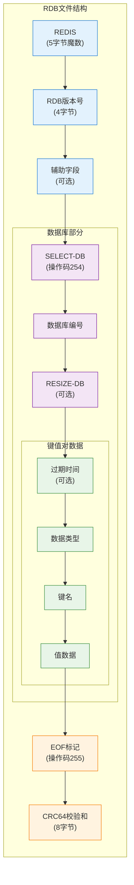
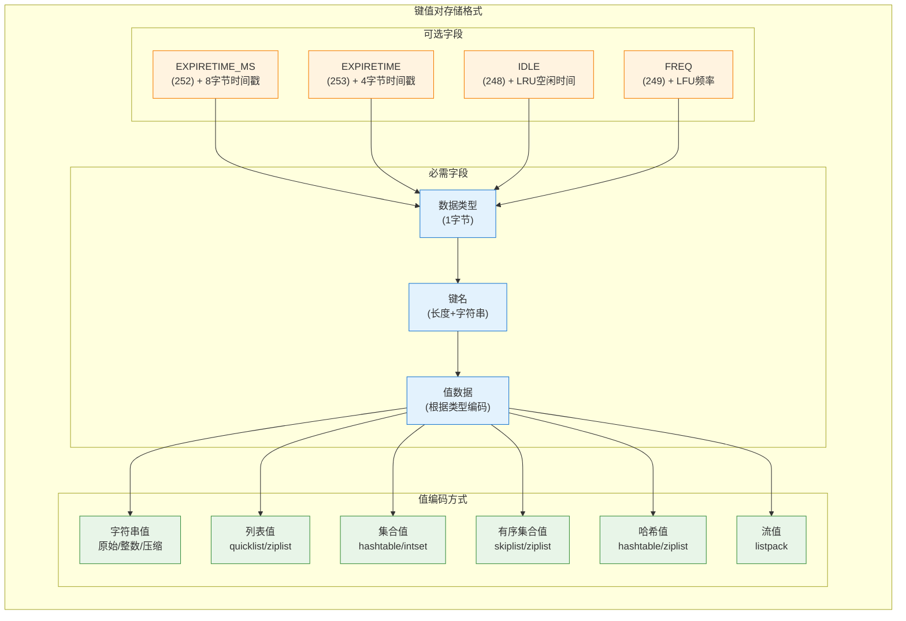
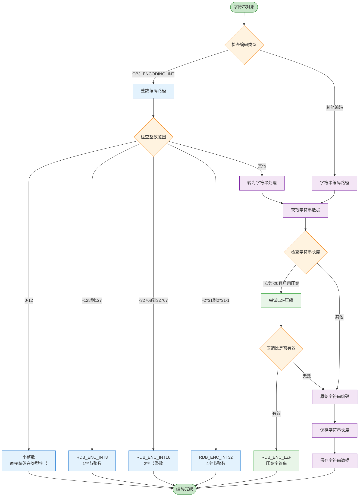
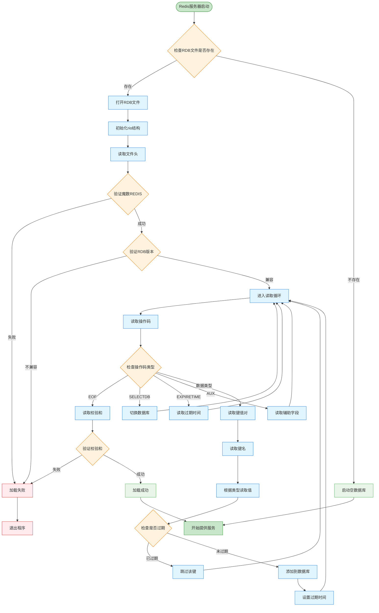
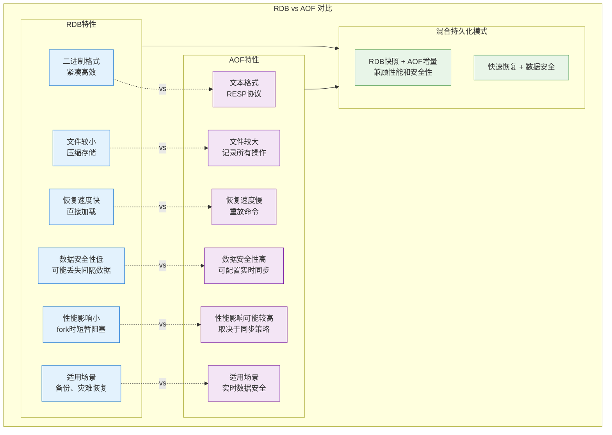

# Redis RDB 数据存储机制详解

Redis Database (RDB) 是 Redis 的持久化机制之一，它通过生成数据库快照（snapshot）的方式，将内存中的数据以二进制格式保存到磁盘文件中。本文将详细分析 RDB 的数据存储机制。

## 1. RDB 文件结构

RDB 文件是一个经过精心设计的二进制格式文件，其整体结构如下：



```
+-------+-------------+-----------+-----------+-----+-----------+
| REDIS | RDB-VERSION | SELECT-DB | KEY-VALUE | EOF | CHECK-SUM |
+-------+-------------+-----------+-----------+-----+-----------+
```

### 1.1 文件头部

RDB 文件以魔数 "REDIS" 开头，用于标识这是一个 Redis RDB 文件：

```c
// 在 rdb.c 中
static int rdbWriteRaw(rio *rdb, void *p, size_t len) {
    if (rdb && rioWrite(rdb,p,len) == 0)
        return -1;
    return len;
}

/* 写入 RDB 文件头 */
static int rdbSaveRio(rio *rdb, int *error, int flags, rdbSaveInfo *rsi) {
    char magic[10];
    
    // 魔数 "REDIS" + RDB 版本号
    snprintf(magic,sizeof(magic),"REDIS%04d",RDB_VERSION);
    if (rdbWriteRaw(rdb,magic,9) == -1) goto werr;
    
    // ... 其他代码 ...
}
```

### 1.2 RDB 版本号

紧跟在魔数之后的是 RDB 文件格式的版本号，用于兼容性检查：

```c
// 在 rdb.h 中
#define RDB_VERSION 9  // 当前 RDB 版本号
```

### 1.3 数据库选择器

RDB 文件可以包含多个数据库的数据，通过 SELECT-DB 操作码来切换数据库：

```c
// 在 rdb.c 中
#define RDB_OPCODE_SELECTDB 254  // 选择数据库的操作码

/* 保存数据库 */
static int rdbSaveDb(rio *rdb, redisDb *db, int flags, long long *key_counter) {
    dictIterator *di;
    dictEntry *de;
    int j;
    
    // 写入 SELECTDB 操作码
    if (rdbSaveType(rdb,RDB_OPCODE_SELECTDB) == -1) return -1;
    
    // 写入数据库编号
    if (rdbSaveLen(rdb,db->id) == -1) return -1;
    
    // ... 保存键值对 ...
}
```

### 1.4 键值对存储

每个键值对的存储格式如下：



```
+-----+------+-----+-------+
| TYPE| KEY  | TTL | VALUE |
+-----+------+-----+-------+
```

其中：
- TYPE：表示值的数据类型（字符串、列表、集合等）
- KEY：键名
- TTL：过期时间（可选）
- VALUE：根据类型不同，有不同的编码方式

```c
// 在 rdb.c 中
/* 保存键值对 */
static int rdbSaveKeyValuePair(rio *rdb, robj *key, robj *val, long long expiretime) {
    // 保存过期时间（如果有）
    if (expiretime != -1) {
        if (rdbSaveType(rdb,RDB_OPCODE_EXPIRETIME_MS) == -1) return -1;
        if (rdbSaveMillisecondTime(rdb,expiretime) == -1) return -1;
    }
    
    // 保存值的类型
    if (rdbSaveObjectType(rdb,val) == -1) return -1;
    
    // 保存键名
    if (rdbSaveStringObject(rdb,key) == -1) return -1;
    
    // 根据类型保存值
    if (rdbSaveObject(rdb,val) == -1) return -1;
    
    return 1;
}
```

### 1.5 文件结束标记

RDB 文件以特殊的 EOF 标记结束：

```c
// 在 rdb.c 中
#define RDB_OPCODE_EOF 255  // 文件结束标记

/* 保存 RDB 文件 */
static int rdbSaveRio(rio *rdb, int *error, int flags, rdbSaveInfo *rsi) {
    // ... 其他代码 ...
    
    // 写入 EOF 标记
    if (rdbSaveType(rdb,RDB_OPCODE_EOF) == -1) goto werr;
    
    // ... 其他代码 ...
}
```

### 1.6 校验和

最后是一个 8 字节的 CRC64 校验和，用于验证文件完整性：

```c
// 在 rdb.c 中
/* 计算并写入校验和 */
static int rdbSaveRio(rio *rdb, int *error, int flags, rdbSaveInfo *rsi) {
    // ... 其他代码 ...
    
    // 计算并写入校验和
    cksum = rdb->cksum;
    memrev64ifbe(&cksum);
    if (rioWrite(rdb,&cksum,8) == 0) goto werr;
    
    // ... 其他代码 ...
}
```

## 2. 数据类型编码

RDB 文件中，不同的数据类型使用不同的编码方式存储：

```mermaid
graph TB
    subgraph RDBTypes["RDB数据类型编码"]
        subgraph BasicTypes["基础数据类型"]
            String["RDB_TYPE_STRING<br/>(0)"]
            List["RDB_TYPE_LIST<br/>(1)"]
            Set["RDB_TYPE_SET<br/>(2)"]
            ZSet["RDB_TYPE_ZSET<br/>(3)"]
            Hash["RDB_TYPE_HASH<br/>(4)"]
        end

        subgraph OptimizedTypes["优化编码类型"]
            ZSet2["RDB_TYPE_ZSET_2<br/>(5)"]
            HashZipmap["RDB_TYPE_HASH_ZIPMAP<br/>(9)"]
            ListZiplist["RDB_TYPE_LIST_ZIPLIST<br/>(10)"]
            SetIntset["RDB_TYPE_SET_INTSET<br/>(11)"]
            ZSetZiplist["RDB_TYPE_ZSET_ZIPLIST<br/>(12)"]
            HashZiplist["RDB_TYPE_HASH_ZIPLIST<br/>(13)"]
            ListQuicklist["RDB_TYPE_LIST_QUICKLIST<br/>(14)"]
            StreamListpacks["RDB_TYPE_STREAM_LISTPACKS<br/>(15)"]
            HashListpack["RDB_TYPE_HASH_LISTPACK<br/>(16)"]
            ZSetListpack["RDB_TYPE_ZSET_LISTPACK<br/>(17)"]
            SetListpack["RDB_TYPE_SET_LISTPACK<br/>(20)"]
        end

        subgraph StringEncodings["字符串编码方式"]
            RawString["原始字符串"]
            IntString["整数编码"]
            CompressedString["LZF压缩"]

            subgraph IntEncodings["整数编码类型"]
                Int8["RDB_ENC_INT8<br/>(8位整数)"]
                Int16["RDB_ENC_INT16<br/>(16位整数)"]
                Int32["RDB_ENC_INT32<br/>(32位整数)"]
            end
        end

        subgraph SpecialOpcodes["特殊操作码"]
            SelectDB["RDB_OPCODE_SELECTDB<br/>(254)"]
            ExpireTime["RDB_OPCODE_EXPIRETIME<br/>(253)"]
            ExpireTimeMS["RDB_OPCODE_EXPIRETIME_MS<br/>(252)"]
            ResizeDB["RDB_OPCODE_RESIZEDB<br/>(251)"]
            AuxField["RDB_OPCODE_AUX<br/>(250)"]
            EOF["RDB_OPCODE_EOF<br/>(255)"]
        end
    end

    %% 连接关系
    String --> RawString
    String --> IntString
    String --> CompressedString
    IntString --> Int8
    IntString --> Int16
    IntString --> Int32

    %% 样式
    classDef basicStyle fill:#e3f2fd,stroke:#1976d2
    classDef optimizedStyle fill:#f3e5f5,stroke:#7b1fa2
    classDef stringStyle fill:#e8f5e8,stroke:#388e3c
    classDef intStyle fill:#fff3e0,stroke:#f57c00
    classDef opcodeStyle fill:#fce4ec,stroke:#c2185b

    class String,List,Set,ZSet,Hash basicStyle
    class ZSet2,HashZipmap,ListZiplist,SetIntset,ZSetZiplist,HashZiplist,ListQuicklist,StreamListpacks,HashListpack,ZSetListpack,SetListpack optimizedStyle
    class RawString,IntString,CompressedString stringStyle
    class Int8,Int16,Int32 intStyle
    class SelectDB,ExpireTime,ExpireTimeMS,ResizeDB,AuxField,EOF opcodeStyle
```



### 2.1 字符串编码

字符串可以使用多种编码方式，包括整数编码、压缩编码和原始编码：



```c
// 在 rdb.c 中
/* 保存字符串对象 */
int rdbSaveStringObject(rio *rdb, robj *obj) {
    // 尝试整数编码
    if (obj->encoding == OBJ_ENCODING_INT) {
        long long value = (long long)obj->ptr;
        if (value >= 0 && value <= 12) {
            // 小整数直接编码在类型字节中
            if (rdbWriteRaw(rdb,shared.integers[value]->ptr,1) == -1) return -1;
            return 1;
        } else if (value >= -(1<<7) && value <= (1<<7)-1) {
            // 8位整数编码
            unsigned char buf[2] = {RDB_ENC_INT8,(unsigned char)value};
            if (rdbWriteRaw(rdb,buf,2) == -1) return -1;
            return 2;
        } else if (value >= -(1<<15) && value <= (1<<15)-1) {
            // 16位整数编码
            unsigned char buf[3];
            buf[0] = RDB_ENC_INT16;
            memcpy(buf+1,&value,2);
            if (rdbWriteRaw(rdb,buf,3) == -1) return -1;
            return 3;
        } else if (value >= -(1LL<<31) && value <= (1LL<<31)-1) {
            // 32位整数编码
            unsigned char buf[5];
            buf[0] = RDB_ENC_INT32;
            memcpy(buf+1,&value,4);
            if (rdbWriteRaw(rdb,buf,5) == -1) return -1;
            return 5;
        }
    }
    
    // 获取字符串内容
    size_t len;
    unsigned char *p = (unsigned char*)stringObjectPtr(obj,&len);
    
    // 尝试压缩编码
    if (len > 20 && server.rdb_compression) {
        // ... 压缩逻辑 ...
    }
    
    // 原始编码
    if (rdbSaveRawString(rdb,p,len) == -1) return -1;
    return 1;
}
```

### 2.2 列表编码

列表可以使用 quicklist 或 ziplist 编码：

```c
// 在 rdb.c 中
/* 保存列表对象 */
int rdbSaveListObject(rio *rdb, robj *obj) {
    if (obj->encoding == OBJ_ENCODING_QUICKLIST) {
        quicklist *ql = obj->ptr;
        quicklistNode *node = ql->head;
        
        // 写入列表长度
        if (rdbSaveLen(rdb,ql->len) == -1) return -1;
        
        // 遍历并保存每个节点
        while(node) {
            if (quicklistNodeIsCompressed(node)) {
                // ... 处理压缩节点 ...
            } else {
                // ... 处理普通节点 ...
            }
            node = node->next;
        }
    } else {
        serverPanic("Unknown list encoding");
    }
    return 1;
}
```

### 2.3 集合编码

集合可以使用 intset 或 hashtable 编码：

```c
// 在 rdb.c 中
/* 保存集合对象 */
int rdbSaveSetObject(rio *rdb, robj *obj) {
    if (obj->encoding == OBJ_ENCODING_HT) {
        dict *set = obj->ptr;
        dictIterator *di = dictGetIterator(set);
        dictEntry *de;
        
        // 写入集合大小
        if (rdbSaveLen(rdb,dictSize(set)) == -1) return -1;
        
        // 遍历并保存每个元素
        while((de = dictNext(di)) != NULL) {
            robj *ele = dictGetKey(de);
            if (rdbSaveStringObject(rdb,ele) == -1) return -1;
        }
        dictReleaseIterator(di);
    } else if (obj->encoding == OBJ_ENCODING_INTSET) {
        // ... 保存整数集合 ...
    } else {
        serverPanic("Unknown set encoding");
    }
    return 1;
}
```

### 2.4 有序集合编码

有序集合可以使用 ziplist 或 skiplist 编码：

```c
// 在 rdb.c 中
/* 保存有序集合对象 */
int rdbSaveZsetObject(rio *rdb, robj *obj) {
    if (obj->encoding == OBJ_ENCODING_ZIPLIST) {
        // ... 保存 ziplist 编码的有序集合 ...
    } else if (obj->encoding == OBJ_ENCODING_SKIPLIST) {
        zset *zs = obj->ptr;
        zskiplist *zsl = zs->zsl;
        
        // 写入有序集合大小
        if (rdbSaveLen(rdb,zsl->length) == -1) return -1;
        
        // 遍历并保存每个元素和分数
        zskiplistNode *zn = zsl->header->level[0].forward;
        while(zn != NULL) {
            if (rdbSaveStringObject(rdb,zn->obj) == -1) return -1;
            if (rdbSaveBinaryDoubleValue(rdb,zn->score) == -1) return -1;
            zn = zn->level[0].forward;
        }
    } else {
        serverPanic("Unknown sorted set encoding");
    }
    return 1;
}
```

### 2.5 哈希表编码

哈希表可以使用 ziplist 或 hashtable 编码：

```c
// 在 rdb.c 中
/* 保存哈希表对象 */
int rdbSaveHashObject(rio *rdb, robj *obj) {
    if (obj->encoding == OBJ_ENCODING_HT) {
        dict *d = obj->ptr;
        dictIterator *di = dictGetIterator(d);
        dictEntry *de;
        
        // 写入哈希表大小
        if (rdbSaveLen(rdb,dictSize(d)) == -1) return -1;
        
        // 遍历并保存每个键值对
        while((de = dictNext(di)) != NULL) {
            robj *key = dictGetKey(de);
            robj *val = dictGetVal(de);
            if (rdbSaveStringObject(rdb,key) == -1) return -1;
            if (rdbSaveStringObject(rdb,val) == -1) return -1;
        }
        dictReleaseIterator(di);
    } else if (obj->encoding == OBJ_ENCODING_ZIPLIST) {
        // ... 保存 ziplist 编码的哈希表 ...
    } else {
        serverPanic("Unknown hash encoding");
    }
    return 1;
}
```

## 3. RDB 文件生成过程

RDB 文件的生成有两种方式：同步生成和异步生成。

```mermaid
graph TB
    subgraph RDBGeneration["RDB文件生成流程"]
        subgraph Triggers["触发方式"]
            SaveCmd["SAVE命令<br/>(同步)"]
            BgSaveCmd["BGSAVE命令<br/>(异步)"]
            AutoSave["自动保存<br/>(配置触发)"]
        end

        subgraph SyncProcess["同步生成流程"]
            SyncStart[开始SAVE]
            BlockServer[阻塞服务器]
            SyncGenerate[生成RDB文件]
            SyncComplete[完成并返回]
        end

        subgraph AsyncProcess["异步生成流程"]
            AsyncStart[开始BGSAVE]
            ForkProcess[fork子进程]
            ParentContinue[父进程继续服务]
            ChildGenerate[子进程生成RDB]
            ChildExit[子进程退出]
            ParentNotify[父进程收到通知]
        end

        subgraph GenerationSteps["RDB生成步骤"]
            WriteHeader[写入文件头<br/>REDIS + 版本号]
            WriteAux[写入辅助字段]
            WriteDBs[遍历所有数据库]
            WriteSelectDB[写入SELECT-DB操作码]
            WriteKVPairs[写入键值对数据]
            WriteEOF[写入EOF标记]
            WriteChecksum[写入CRC64校验和]
        end
    end

    %% 连接关系
    SaveCmd --> SyncStart
    BgSaveCmd --> AsyncStart
    AutoSave --> AsyncStart

    SyncStart --> BlockServer
    BlockServer --> SyncGenerate
    SyncGenerate --> SyncComplete

    AsyncStart --> ForkProcess
    ForkProcess --> ParentContinue
    ForkProcess --> ChildGenerate
    ChildGenerate --> ChildExit
    ChildExit --> ParentNotify

    SyncGenerate --> WriteHeader
    ChildGenerate --> WriteHeader
    WriteHeader --> WriteAux
    WriteAux --> WriteDBs
    WriteDBs --> WriteSelectDB
    WriteSelectDB --> WriteKVPairs
    WriteKVPairs --> WriteEOF
    WriteEOF --> WriteChecksum

    %% 样式
    classDef triggerStyle fill:#e3f2fd,stroke:#1976d2
    classDef syncStyle fill:#ffecb3,stroke:#f57c00
    classDef asyncStyle fill:#c8e6c9,stroke:#388e3c
    classDef stepStyle fill:#f3e5f5,stroke:#7b1fa2

    class SaveCmd,BgSaveCmd,AutoSave triggerStyle
    class SyncStart,BlockServer,SyncGenerate,SyncComplete syncStyle
    class AsyncStart,ForkProcess,ParentContinue,ChildGenerate,ChildExit,ParentNotify asyncStyle
    class WriteHeader,WriteAux,WriteDBs,WriteSelectDB,WriteKVPairs,WriteEOF,WriteChecksum stepStyle
```



### 3.1 同步生成 (SAVE 命令)

SAVE 命令会阻塞 Redis 服务器，直到 RDB 文件生成完成：

```c
// 在 rdb.c 中
/* SAVE 命令实现 */
void saveCommand(client *c) {
    if (server.rdb_child_pid != -1) {
        addReplyError(c,"Background save already in progress");
        return;
    }
    
    rdbSaveInfo rsi = RDB_SAVE_INFO_INIT;
    if (rdbSave(server.rdb_filename,&rsi) == C_OK) {
        addReply(c,shared.ok);
    } else {
        addReply(c,shared.err);
    }
}
```

### 3.2 异步生成 (BGSAVE 命令)

BGSAVE 命令会创建一个子进程来生成 RDB 文件，不会阻塞主进程：

```c
// 在 rdb.c 中
/* BGSAVE 命令实现 */
void bgsaveCommand(client *c) {
    if (server.rdb_child_pid != -1) {
        addReplyError(c,"Background save already in progress");
    } else if (server.aof_child_pid != -1) {
        addReplyError(c,"Can't BGSAVE while AOF rewrite is in progress");
    } else {
        rdbSaveInfo rsi = RDB_SAVE_INFO_INIT;
        if (rdbSaveBackground(server.rdb_filename,&rsi) == C_OK) {
            addReplyStatus(c,"Background saving started");
        } else {
            addReply(c,shared.err);
        }
    }
}
```

### 3.3 自动生成

Redis 可以配置在满足特定条件时自动生成 RDB 文件：

```c
// 在 server.c 中
/* 检查是否需要自动保存 */
void serverCron(struct aeEventLoop *eventLoop, long long id, void *clientData) {
    // ... 其他代码 ...
    
    /* 检查是否满足自动保存条件 */
    for (j = 0; j < server.saveparamslen; j++) {
        struct saveparam *sp = server.saveparams+j;
        
        // 如果在指定时间内有足够的修改，触发 BGSAVE
        if (server.dirty >= sp->changes &&
            server.unixtime-server.lastsave > sp->seconds)
        {
            rdbSaveInfo rsi = RDB_SAVE_INFO_INIT;
            rdbSaveBackground(server.rdb_filename,&rsi);
            break;
        }
    }
    
    // ... 其他代码 ...
}
```

## 4. RDB 文件加载过程

当 Redis 服务器启动时，如果配置了 RDB 持久化，会尝试加载 RDB 文件：



```c
// 在 rdb.c 中
/* 加载 RDB 文件 */
int rdbLoad(char *filename, rdbSaveInfo *rsi) {
    FILE *fp;
    rio rdb;
    int retval;
    
    // 打开 RDB 文件
    if ((fp = fopen(filename,"r")) == NULL) return C_ERR;
    
    // 初始化 rio
    rioInitWithFile(&rdb,fp);
    
    // 加载 RDB 文件
    retval = rdbLoadRio(&rdb,rsi,0);
    
    // 关闭文件
    fclose(fp);
    
    return retval;
}

/* 从 rio 加载 RDB 数据 */
int rdbLoadRio(rio *rdb, rdbSaveInfo *rsi, int loading_aof) {
    char buf[10];
    int type, dbid;
    long long expiretime, now = mstime();
    
    // 读取并验证魔数和版本号
    if (rioRead(rdb,buf,9) == 0) goto eoferr;
    buf[9] = '\0';
    if (memcmp(buf,"REDIS",5) != 0) {
        serverLog(LL_WARNING,"Wrong signature trying to load DB from file");
        errno = EINVAL;
        return C_ERR;
    }
    
    // ... 其他验证 ...
    
    // 循环读取操作码和数据
    while(1) {
        robj *key, *val;
        
        // 读取类型
        if ((type = rdbLoadType(rdb)) == -1) goto eoferr;
        
        // 文件结束
        if (type == RDB_OPCODE_EOF) break;
        
        // 过期时间
        if (type == RDB_OPCODE_EXPIRETIME) {
            // ... 处理过期时间 ...
            continue;
        }
        
        // 选择数据库
        if (type == RDB_OPCODE_SELECTDB) {
            // ... 切换数据库 ...
            continue;
        }
        
        // 读取键
        if ((key = rdbLoadStringObject(rdb)) == NULL) goto eoferr;
        
        // 读取值
        if ((val = rdbLoadObject(type,rdb)) == NULL) goto eoferr;
        
        // 检查过期时间
        if (expiretime != -1 && expiretime < now) {
            // 已过期，跳过
            decrRefCount(key);
            decrRefCount(val);
            continue;
        }
        
        // 添加到数据库
        dbAdd(server.db+dbid,key,val);
        
        // 设置过期时间
        if (expiretime != -1) setExpire(NULL,server.db+dbid,key,expiretime);
        
        decrRefCount(key);
    }
    
    // ... 其他代码 ...
    
    return C_OK;
    
eoferr:
    // ... 错误处理 ...
    return C_ERR;
}
```

## 5. RDB 的优缺点

### 5.1 优点

1. **紧凑的二进制格式**：RDB 文件是一个紧凑的二进制文件，非常适合备份和恢复。
2. **性能优势**：与 AOF 相比，RDB 在恢复大数据集时速度更快。
3. **子进程生成**：使用 BGSAVE 时，RDB 文件由子进程生成，几乎不影响主进程。
4. **适合灾难恢复**：RDB 文件包含某一时刻的完整数据快照，非常适合灾难恢复。

### 5.2 缺点

1. **数据丢失风险**：RDB 文件只能保存某一时刻的数据，两次保存之间的数据可能会丢失。
2. **fork 开销**：生成 RDB 文件需要 fork 子进程，对于内存较大的实例，可能会导致服务短暂暂停。
3. **不适合实时备份**：由于 RDB 文件生成的间隔性，不适合需要实时备份的场景。

## 6. RDB 与 AOF 的比较



| 特性    | RDB           | AOF            |
|-------|---------------|----------------|
| 文件格式  | 二进制           | 文本（RESP 协议）    |
| 文件大小  | 较小            | 较大             |
| 恢复速度  | 快             | 慢              |
| 数据安全性 | 低（可能丢失间隔期的数据） | 高（可配置为每条命令都同步） |
| 对性能影响 | 低（除了 fork 时）  | 可能较高（取决于同步策略）  |
| 适用场景  | 备份、灾难恢复       | 实时数据安全性要求高的场景  |

## 7. 总结

Redis RDB 持久化机制通过生成数据库快照的方式，将内存中的数据以二进制格式保存到磁盘文件中。它使用精心设计的文件格式，支持多种数据类型和编码方式，提供了高效的数据备份和恢复能力。

RDB 文件的生成可以通过 SAVE 命令同步执行，也可以通过 BGSAVE 命令异步执行，还可以配置自动触发条件。在 Redis 服务器启动时，如果配置了 RDB 持久化，会尝试加载 RDB 文件来恢复数据。

虽然 RDB 持久化在性能和文件大小方面有优势，但在数据安全性方面存在一定风险。在实际应用中，通常会结合 RDB 和 AOF 两种持久化机制，或使用 Redis 4.0 引入的混合持久化模式，以获得更好的性能和数据安全性平衡。
