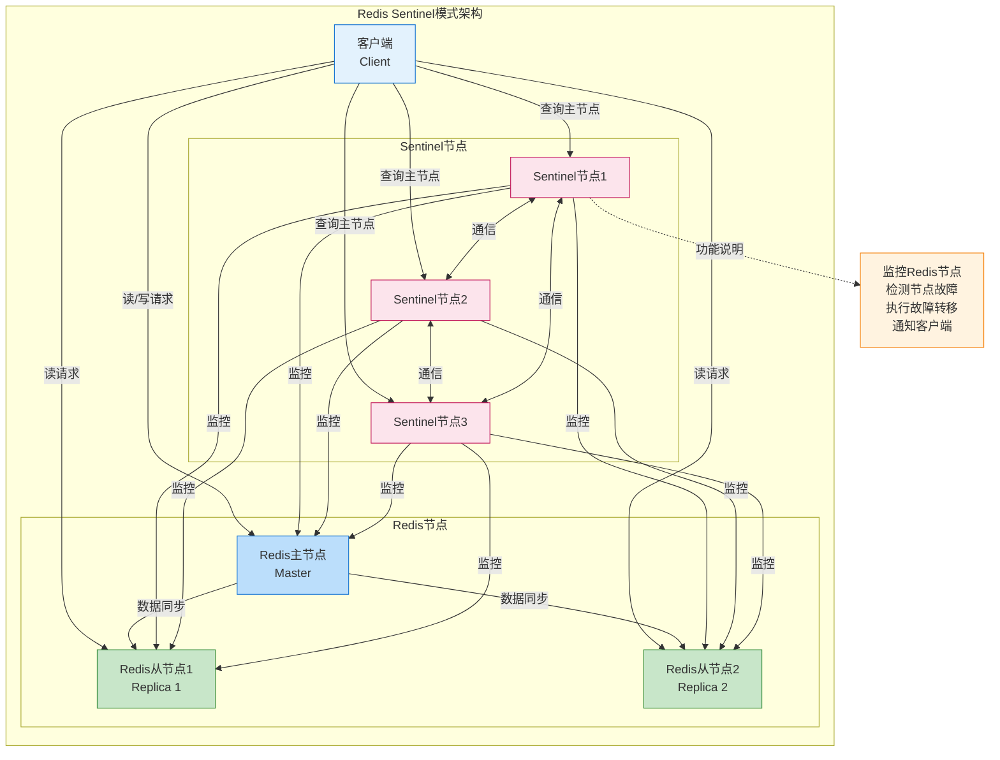
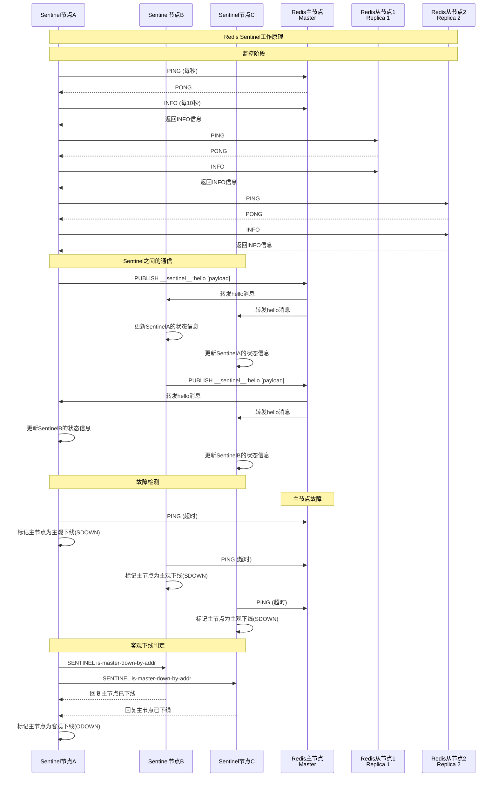
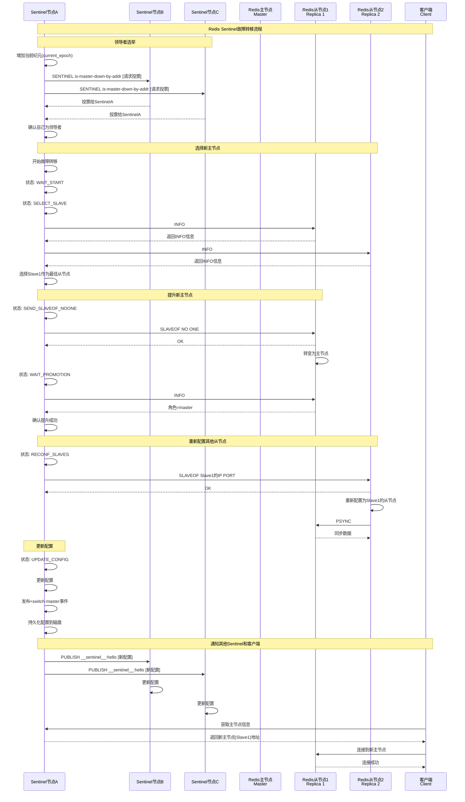
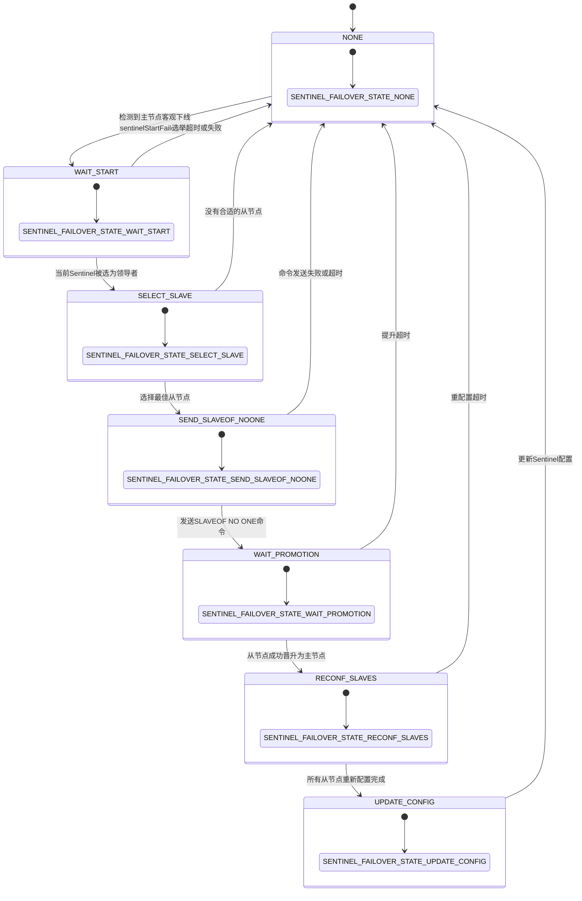

# Redis Sentinel模式

Redis Sentinel是Redis的高可用解决方案，提供监控、通知、自动故障转移和配置提供者服务。Sentinel模式基于主从复制模式，增加了自动故障检测和转移功能。

## Sentinel模式特点

- 监控：监控Redis主从节点的健康状态
- 通知：当被监控的Redis实例出现问题时，通知管理员或其他程序
- 自动故障转移：当主节点故障时，自动选择一个从节点升级为新的主节点
- 配置提供者：客户端连接到Sentinel获取当前主节点的地址

## Sentinel模式架构



## Sentinel工作原理



## Sentinel故障转移流程



## Sentinel状态机



## Sentinel模式的优缺点

### 优点
1. **高可用性**：自动故障检测和转移
2. **分布式监控**：多个Sentinel共同监控，避免单点故障
3. **客户端支持**：提供服务发现机制，客户端可以查询当前主节点
4. **通知功能**：可以配置通知脚本，在故障发生时通知管理员

### 缺点
1. **部署复杂**：需要部署多个Sentinel节点
2. **额外资源消耗**：Sentinel节点需要额外的服务器资源
3. **不支持分片**：无法解决数据量过大的问题
4. **故障转移期间短暂不可用**：在故障转移过程中可能有短暂的服务不可用

## Sentinel模式配置示例

### Sentinel配置 (sentinel.conf)
```conf
port 26379
daemonize yes
pidfile /var/run/redis-sentinel.pid
logfile /var/log/redis/sentinel.log
dir /tmp

# 监控的主节点，名称为mymaster，至少需要2个Sentinel同意才能进行故障转移
sentinel monitor mymaster 127.0.0.1 6379 2

# 30秒内无法连接主节点则判定为主观下线
sentinel down-after-milliseconds mymaster 30000

# 故障转移超时时间
sentinel failover-timeout mymaster 180000

# 同时进行复制的从节点数量
sentinel parallel-syncs mymaster 1

# 通知脚本
# sentinel notification-script mymaster /var/redis/notify.sh

# 客户端重新配置脚本
# sentinel client-reconfig-script mymaster /var/redis/reconfig.sh
```

### 主节点配置 (redis-master.conf)
```conf
port 6379
bind 0.0.0.0
daemonize yes
pidfile /var/run/redis_6379.pid
logfile /var/log/redis/redis_6379.log
dir /var/lib/redis
dbfilename dump_6379.rdb
appendonly yes
appendfilename "appendonly_6379.aof"
```

### 从节点配置 (redis-replica.conf)
```conf
port 6380
bind 0.0.0.0
daemonize yes
pidfile /var/run/redis_6380.pid
logfile /var/log/redis/redis_6380.log
dir /var/lib/redis
dbfilename dump_6380.rdb
appendonly yes
appendfilename "appendonly_6380.aof"
replicaof 127.0.0.1 6379
replica-read-only yes
```
