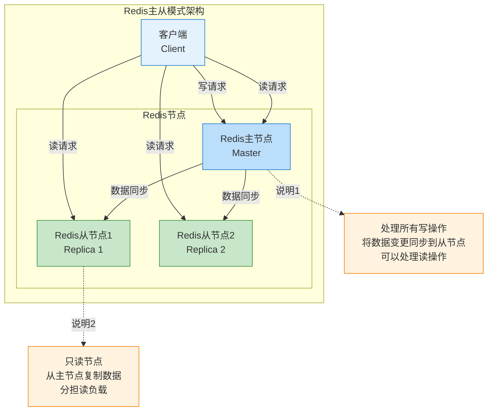
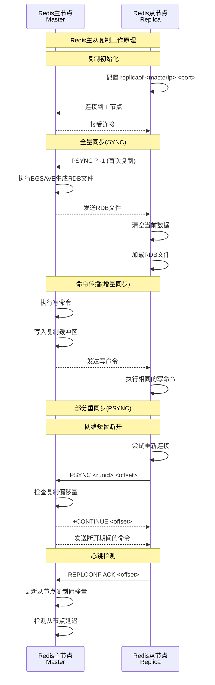
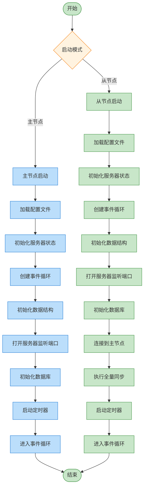
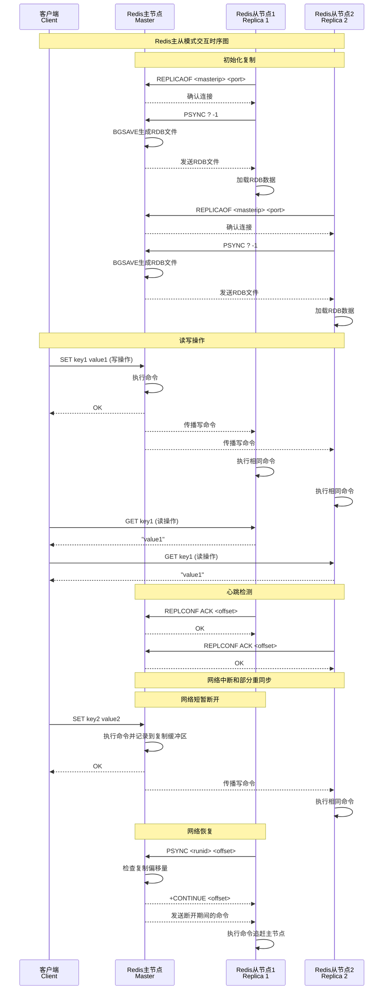

# Redis主从模式

Redis主从模式是一种基本的高可用配置，由一个主节点(Master)和一个或多个从节点(Replica/Slave)组成。主节点处理写操作并将数据变更同步到从节点，从节点主要处理读操作。

## 主从模式特点

- 数据冗余，提高数据安全性
- 读写分离，提高读取性能
- 主节点仍存在单点故障风险
- 不提供自动故障转移功能

## 主从模式架构



## 主从复制工作原理



## 主从复制是怎么工作的

### Redis怎么管理复制状态

简单来说，Redis需要记住很多信息来保证主从复制正常工作。就像你要记住朋友的电话号码一样，Redis也要记住主节点在哪里、连接状态如何等等。

#### 主要记录的信息

**连接相关的信息**：
- `masterhost`和`masterport`：主节点的地址，就像朋友的家庭住址
- `master`：跟主节点的连接，可以理解为一条电话线
- `repl_state`：当前在做什么，比如正在连接、正在同步数据等

**数据传输相关的信息**：
- `repl_transfer_size`：要传输的数据总量，就像下载文件时显示的总大小
- `repl_transfer_read`：已经传输了多少，类似下载进度
- `repl_transfer_fd`：传输数据用的通道

**复制积压缓冲区**：
这个很重要！可以把它想象成一个录音机，主节点把所有的操作都"录"下来。如果从节点断开了一会儿，重连后可以"回放"这段时间错过的操作，而不用重新传输所有数据。

**复制ID和偏移量**：
- `replid`：给每次复制起个名字，就像给聊天记录起个标题
- `master_repl_offset`：记录处理到第几条命令了，类似聊天记录的行号
- 这样就能知道从哪里开始补数据

### 从节点是怎么连接主节点的

从节点连接主节点就像两个人第一次见面，需要经过好几个步骤才能开始正常交流：

#### 第一步：建立连接
1. **准备连接**：从节点决定要连接主节点了
2. **正在连接**：就像拨电话号码，等待接通
3. **测试连接**：发个"喂"（PING）看看能不能听到

#### 第二步：身份验证
4. **发送密码**：如果主节点设了密码，就要先验证身份
5. **等待确认**：主节点检查密码对不对

#### 第三步：互相介绍
6. **告诉端口**：从节点说"我在这个端口监听"
7. **告诉IP**：从节点说"我的IP地址是这个"
8. **说明能力**：从节点说"我支持这些功能"

#### 第四步：开始同步
9. **请求同步**：从节点说"请给我数据"
10. **等待回复**：主节点决定怎么给数据
11. **传输数据**：开始接收数据或命令
12. **完成连接**：一切就绪，开始正常工作

这样设计的好处：
- **不容易出错**：每一步都很清楚，出问题容易发现
- **容易监控**：可以知道卡在哪一步了
- **容易扩展**：以后要加新功能很方便

## 主从复制的核心机制

### 主节点怎么处理同步请求

当从节点说"我要同步数据"时，主节点要做个重要决定：是给全部数据，还是只给缺失的部分？

#### 处理流程很简单

**1. 先看看是谁在请求**
主节点会检查：这个从节点是不是已经在我的列表里了？避免重复处理。

**2. 看看能不能只给一部分**
如果从节点发的是PSYNC命令，主节点会想：
- 这个从节点之前跟我同步过吗？（检查复制ID）
- 它缺失的数据我还有备份吗？（检查积压缓冲区）
- 如果都满足，就只给缺失的部分

**3. 不行就给全部**
如果上面的条件不满足，那就只能：
- 把从节点加到等待列表
- 开始生成完整的数据快照（BGSAVE）
- 准备传输所有数据

### 部分重同步是个好东西

这个功能很厉害！想象一下，你在看电影时网络断了一会儿，重连后不用从头开始看，而是从断开的地方继续。

#### 三个关键组件

**1. 积压缓冲区（像个录音机）**
- 主节点把所有操作都"录"下来，默认能录1MB的内容
- 是个圆形的录音带，录满了就覆盖最老的内容
- 每个操作都有个编号，方便找到位置

**2. 复制ID（像个身份证）**
- 每次开始复制都有个唯一的ID
- 主节点换了或重启了，ID就变了
- 还有个备用ID，用于特殊情况

**3. 偏移量（像个进度条）**
- 主节点记录发送了多少数据
- 从节点记录接收了多少数据
- 对比一下就知道缺了什么

#### 判断能不能部分同步

主节点会按顺序检查：

1. **身份证对不对**：
   - 从节点的复制ID跟我的一样吗？
   - 或者跟我的备用ID一样吗？
   - 不一样就得全量同步

2. **缺失的数据还在不在**：
   - 从节点要的数据在我的"录音带"里吗？
   - 太老的可能被覆盖了，太新的还没有
   - 在范围内就能部分同步

3. **开始补数据**：
   - 告诉从节点"可以继续"
   - 把缺失的部分发过去
   - 完成同步

### 命令是怎么传播的

主节点执行了写操作后，要告诉所有从节点"你们也这样做"。

#### 传播过程

**1. 格式化命令**
- 把命令转换成标准格式
- 如果涉及不同数据库，先发个切换命令
- 同时写到"录音带"里备份

**2. 选择接收者**
不是所有从节点都能立即接收：
- 正在等待数据的从节点先不发
- 只给已经在线的从节点发
- 断开的从节点重连后会补上

**3. 异步发送**
- 主节点不等从节点回复就继续干活
- 从节点慢慢处理接收到的命令
- 如果从节点太慢，可能会被踢掉

#### 一些优化技巧

**1. 打包发送**
把多个小命令打包成一个大包发送，减少网络开销。

**2. 独立缓冲区**
每个从节点都有自己的缓冲区，慢的不会影响快的。

**3. 流量控制**
如果从节点的缓冲区太满，主节点会断开连接保护自己。

## 主从模式启动流程



## Redis怎么维护主从复制

### 定时检查很重要

Redis每秒都会做一次"体检"，检查主从复制是不是健康。就像你每天要量体温一样。

#### 主要检查什么

**1. 连接还好吗**
- **握手会不会卡住**：如果从节点连接时卡住了，就重新来
- **数据传输会不会断**：如果传输RDB文件时太久没动静，就断开重连
- **心跳还在跳吗**：如果主从节点太久没说话，就断开连接

**2. 从节点管理**
- **从节点还活着吗**：检查从节点有没有按时发心跳
- **更新状态信息**：记录从节点的最新状态
- **清理坏掉的连接**：把超时或出问题的从节点踢掉

**3. 节省资源**
- **没从节点时释放内存**：如果没有从节点了，就把"录音带"删掉省内存
- **等等再开始传输**：无盘复制时可以等一会儿，看看有没有更多从节点要连接

### 积压缓冲区的秘密

这个"录音带"设计得很巧妙，是部分重同步的核心。

#### 它是怎么工作的

**1. 基本设计**
- **固定大小**：默认1MB，就像一盘固定长度的录音带
- **圆形录音带**：录满了就从头开始覆盖，永远在转圈
- **每个位置都有编号**：方便找到具体位置

**2. 重要的几个指标**
- `repl_backlog_size`：录音带总长度
- `repl_backlog_idx`：现在录到哪里了
- `repl_backlog_off`：最老的数据在哪里
- `repl_backlog_histlen`：有效数据有多长

**3. 怎么写入数据**
主节点每次执行写操作时：
- 把命令转换成标准格式
- 写到录音带的当前位置
- 移动写入位置
- 如果录音带满了，就覆盖最老的数据

#### 怎么读取数据

当从节点要补数据时：

**1. 先检查能不能补**
- 要的数据还在录音带上吗？
- 太老的可能被覆盖了，太新的还没录
- 不在范围内就没法部分同步

**2. 找到数据位置**
- 根据从节点要的位置，在录音带上找到对应地方
- 因为是圆形的，可能要从两段读取

**3. 发送数据**
- 从找到的位置开始，一直发到最新位置
- 按照标准格式发给从节点

#### 怎么优化使用

**1. 大小要合适**
- 太小：经常部分同步失败，要全量同步
- 太大：浪费内存，特别是没从节点时
- 建议：根据网络断开时间和写入速度来算

**2. 生命周期管理**
- 有从节点时保持录音带
- 没从节点时可以设置超时自动删除
- 有新从节点时重新创建

**3. 监控内存使用**
- 录音带占用的内存算在Redis总内存里
- 可以用INFO命令查看使用情况
- 内存紧张时考虑调小一点

## 主从模式交互时序图



## 从节点怎么连接主节点

### 连接过程就像交朋友

从节点连接主节点就像两个人第一次见面交朋友，需要好几个步骤。

#### 先建立联系

**1. 拨通电话**
- 从节点先尝试连接主节点，就像拨电话号码
- 用的是非阻塞方式，不会卡住Redis
- 连不上就记录错误，过会儿再试

**2. 记录连接信息**
连接过程中要记住几个重要信息：
- `repl_transfer_s`：这条连接线
- `repl_transfer_lastio`：最后一次通话时间
- `repl_state`：现在在做什么

### 握手过程很详细

就像两个人见面要互相介绍一样，从节点和主节点也要经过详细的握手。

#### 先验证身份

**1. 打个招呼 (PING测试)**
- 从节点先发个"喂"（PING）
- 主节点回个"嗯"（PONG）表示听到了
- 如果主节点说需要密码，那就要验证身份

**2. 验证身份 (AUTH)**
- 如果主节点设了密码，从节点就要报密码
- 主节点检查密码对不对
- 密码错了就断开连接

#### 互相介绍信息

**3. 告诉端口号**
从节点说："我在这个端口监听"
- 主节点记下这个信息
- 以后可能会用到（比如监控）
- 支持NAT环境的特殊配置

**4. 告诉IP地址**
从节点说："我的IP地址是这个"
- 主节点记录完整的网络地址
- 用于管理和监控从节点
- 支持复杂网络环境

**5. 说明自己的能力**
从节点说："我支持这些功能"
- `eof`：我支持无盘复制
- `psync2`：我支持更强的部分重同步
- 主节点根据这些能力选择最好的策略

#### 开始请求数据

**6. 发送同步请求 (PSYNC)**
从节点说："请给我数据"
- 第一次连接：`PSYNC ? -1`（我要全部数据）
- 重新连接：`PSYNC <replid> <offset>`（我要从这里开始的数据）

**7. 等待主节点回复**
主节点会回复：
- `+FULLRESYNC`：你需要全部数据
- `+CONTINUE`：我给你缺失的部分就行
- `+NOMASTERLINK`：我也是从节点，没法给你数据

### 接收RDB数据

如果需要全量同步，从节点要接收主节点的完整数据。

#### 怎么接收文件

**1. 创建临时文件**
- 从节点创建一个临时文件来接收数据
- 文件名包含时间戳，避免冲突
- 接收完成后改名为正式文件

**2. 流式接收**
- 边接收边写到磁盘，不占用太多内存
- 记录接收进度，可以看到传输状态
- 支持传输过程的监控

**3. 检查完整性**
- 通过文件大小检查是否传输完整
- 出错了可以重新传输
- 失败时清理临时文件

#### 怎么加载数据

**1. 清空旧数据**
加载新数据前要：
- 把现有的所有数据都删掉
- 重置统计信息
- 通知其他模块数据要变了

**2. 加载RDB文件**
- 用专门的方式加载RDB文件
- 加载时不让客户端访问
- 加载失败就取消这次同步

**3. 完成连接**
数据加载完成后：
- 创建跟主节点的正式连接
- 状态变为已连接
- 开始接收实时命令

### 出错了怎么办

**1. 超时处理**
- 每个步骤都有时间限制
- 超时了就重新开始
- 记录详细日志方便排查

**2. 网络错误**
- 网络断了立即停止握手
- 断开后会自动重试
- 重试间隔会逐渐增加

**3. 状态恢复**
- 失败后清理所有中间状态
- 重置到初始状态
- 释放占用的资源

## 主从模式的优缺点

### 优点
1. **读写分离**：提高系统读取性能
2. **数据冗余**：多个副本提高数据安全性
3. **高可用基础**：为Sentinel和集群模式提供基础

### 缺点
1. **主节点单点故障**：主节点故障时无法自动切换
2. **写性能瓶颈**：所有写操作都集中在主节点
3. **全量复制开销**：新从节点加入或断开重连时可能需要全量复制
4. **复制延迟**：从节点数据可能落后于主节点

## 两种数据传输方式

Redis有两种传输RDB数据的方式，就像快递有陆运和空运一样。

### 磁盘复制：传统但稳定

这是Redis最早的传输方式，就像先把东西打包好，再寄快递。

#### 怎么工作的

**1. 先生成文件**
需要全量同步时：
- 主节点开个后台进程生成RDB文件
- 就像拍照一样，把当前数据状态保存下来
- 主进程继续干活，不会被影响

**2. 准备传输**
文件生成好后：
- 主节点打开文件准备读取
- 给每个等待的从节点准备传输
- 设置从节点状态为"正在接收数据"

**3. 开始传输**
- 主节点一块一块地读取文件
- 通过网络发送给从节点
- 从节点接收后写到临时文件

#### 优缺点很明显

**好处**：
- **很稳定**：用了很多年，很可靠
- **省内存**：主进程不用占用太多内存
- **能复用**：一个文件可以发给多个从节点

**坏处**：
- **磁盘忙**：要额外读写磁盘
- **占空间**：需要额外的磁盘空间
- **有延迟**：要等文件生成完才能传输

### 无盘复制：新技术更快

这是新功能，就像直接从工厂发货，不用经过仓库。

#### 工作原理

**1. 直接传输**
- 子进程直接把数据写到网络连接
- 不用经过磁盘文件这个中间步骤
- 边生成边传输，更快

**2. 一对多传输**
- 可以同时给多个从节点发送
- 用特殊的技术同时写多个连接
- 一次生成，多个从节点都能收到

**3. 等等再开始**
- 可以等一会儿看看有没有更多从节点要连接
- 这样可以一起传输，更高效
- 减少主节点的负担

#### 什么时候用哪种

**适合无盘复制**：
- 磁盘很慢的时候
- 磁盘空间不够的时候
- 网络很快的时候
- 从节点很多的时候

**不适合无盘复制**：
- 网络不稳定的时候
- 从节点连接时间差很大
- 对可靠性要求特别高的时候

### Redis怎么选择传输方式

Redis会自动选择用哪种方式：

**1. 看配置**
- `repl-diskless-sync`：是否开启无盘复制
- `repl-diskless-sync-delay`：无盘复制等待时间

**2. 看从节点能力**
- 从节点必须支持EOF功能才能用无盘复制
- 通过握手时的能力协商确定

**3. 自动决定**
- 如果配置允许且从节点支持，就用无盘复制
- 否则用传统的磁盘复制

### 心跳机制保持联系

主从节点要定期"通电话"，确保彼此都还在线。

#### ACK命令的作用

**1. 从节点报告进度**
从节点定期发送ACK：
- 格式：`REPLCONF ACK <offset>`
- 告诉主节点自己处理到哪里了
- 主节点用这个跟踪同步进度

**2. 主节点处理ACK**
主节点收到ACK后：
- 更新从节点的最后联系时间
- 记录从节点的进度
- 计算从节点的延迟情况

#### 心跳检测

**1. 超时检测**
- 主节点检查从节点多久没发ACK了
- 超时就断开连接
- 防止僵尸连接浪费资源

**2. 延迟监控**
- 通过ACK的进度计算延迟
- 延迟太大的从节点可能有问题
- 用于负载均衡和故障检测

#### REPLCONF命令很有用

这个命令有很多功能：

**1. 交换信息**
- `listening-port`：从节点的端口
- `ip-address`：从节点的IP
- `capa`：从节点支持的功能

**2. 状态同步**
- `ack`：从节点确认收到的数据量
- `getack`：主节点要求从节点发ACK

**3. 能力协商**
- `eof`：支持无盘复制
- `psync2`：支持增强的部分重同步

这些机制一起工作，让Redis主从复制既可靠又高效。

## 主从模式配置示例

### 主节点配置 (redis-master.conf)
```conf
port 6379
bind 0.0.0.0
daemonize yes
pidfile /var/run/redis_6379.pid
logfile /var/log/redis/redis_6379.log
dir /var/lib/redis
dbfilename dump_6379.rdb
appendonly yes
appendfilename "appendonly_6379.aof"
```

### 从节点配置 (redis-replica.conf)
```conf
port 6380
bind 0.0.0.0
daemonize yes
pidfile /var/run/redis_6380.pid
logfile /var/log/redis/redis_6380.log
dir /var/lib/redis
dbfilename dump_6380.rdb
appendonly yes
appendfilename "appendonly_6380.aof"
replicaof 127.0.0.1 6379  # 指定主节点
replica-read-only yes     # 从节点只读
```

## Redis主从复制总结

### 整个系统是怎么协作的

Redis主从复制就像一个精密的团队，每个组件都有自己的职责。

#### 主要的"团队成员"

**1. 复制管理器（总指挥）**
负责整体协调：
- 管理所有从节点的列表和状态
- 处理各种复制命令
- 管理"录音带"（积压缓冲区）的生命周期

**2. 连接管理器（通信员）**
负责网络连接：
- 建立和维护网络连接
- 处理连接超时和重连
- 管理网络读写事件

**3. 数据传输器（搬运工）**
负责实际传输：
- 生成和传输RDB文件
- 传播实时命令
- 监控传输进度

**4. 状态同步器（协调员）**
保持状态一致：
- 同步复制进度
- 心跳检测和确认
- 故障检测和恢复

### Redis的设计思路

#### 可靠性第一

**1. 多重保护**
- 网络层面：连接超时、自动重连
- 协议层面：命令验证、响应确认
- 数据层面：完整性检查、一致性验证

**2. 状态机设计**
- 每个状态都很明确，不会搞混
- 出问题时有恢复机制
- 状态转换是原子的，不会卡在中间

#### 性能也很重要

**1. 异步处理**
- BGSAVE不会阻塞主进程
- 命令传播用异步I/O
- 心跳检测在后台进行

**2. 资源复用**
- 多个从节点可以共享一个RDB文件
- "录音带"支持多个从节点部分同步
- 无盘复制可以同时传给多个从节点

#### 考虑扩展性

**1. 协议兼容**
- 支持多个版本的PSYNC协议
- 兼容老版本的SYNC命令
- 新功能可以逐步部署

**2. 配置灵活**
- 支持两种复制模式
- 超时时间和缓冲区大小可配置
- 支持复杂网络环境

### 两个重要创新

#### 部分重同步很厉害

这个功能大大减少了重连的成本：

**1. 复制ID机制**
- 每次复制都有唯一ID
- 支持双ID，方便故障转移
- ID变了就要全量同步

**2. 精确跟踪进度**
- 每个字节都有编号
- 支持从任意位置开始同步
- 进度不匹配就降级为全量同步

**3. 环形缓冲区**
- 固定大小，内存可控
- 自动覆盖老数据
- 支持多个从节点并发使用

#### 无盘复制很高效

针对磁盘瓶颈的优化：

**1. 直接网络传输**
- 跳过磁盘文件步骤
- 减少磁盘I/O和存储需求
- 提高传输效率

**2. 一对多传输**
- 一次生成，多点传输
- 减少主节点开销
- 提高整体效率

### 实际使用建议

#### 配置优化

**1. 积压缓冲区大小**
- 根据网络情况和写入速度调整
- 一般1-10MB比较合适
- 网络不稳定可以调大一点

**2. 复制模式选择**
- 磁盘够用：用磁盘复制
- 磁盘紧张：用无盘复制
- 从节点多：优先无盘复制

**3. 超时时间设置**
- 根据网络情况调整
- 不要太短（频繁重连）
- 不要太长（故障检测慢）

#### 监控重点

**1. 复制延迟**
- 监控从节点的进度
- 关注ACK的时间间隔
- 设置合理的告警阈值

**2. 连接状态**
- 监控连接稳定性
- 关注重连频率
- 记录异常情况

**3. 资源使用**
- 监控缓冲区使用情况
- 关注网络带宽占用
- 监控内存使用

Redis主从复制通过精心的设计，既保证了数据一致性，又实现了高性能，是Redis成功的重要基础。
