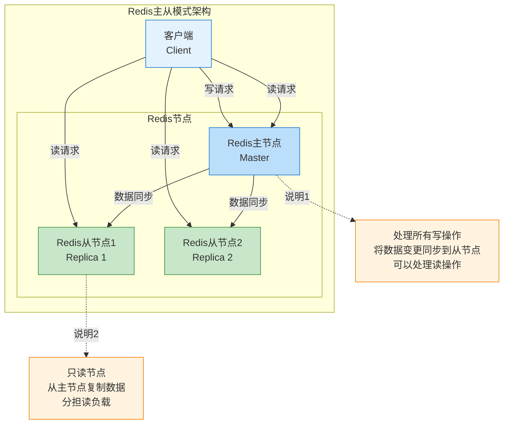
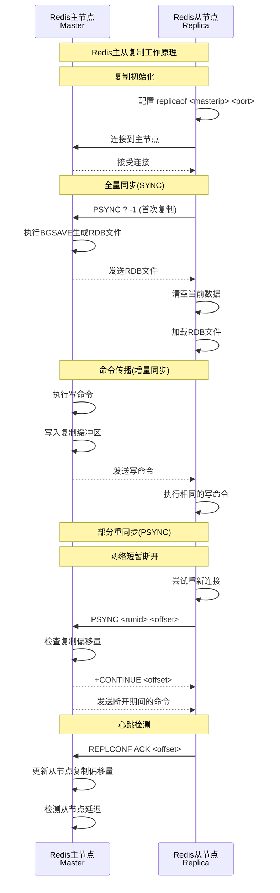
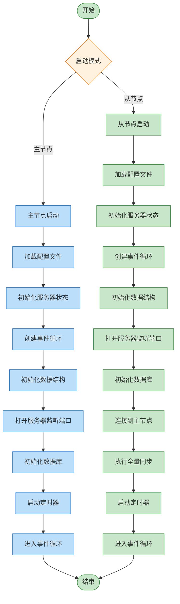
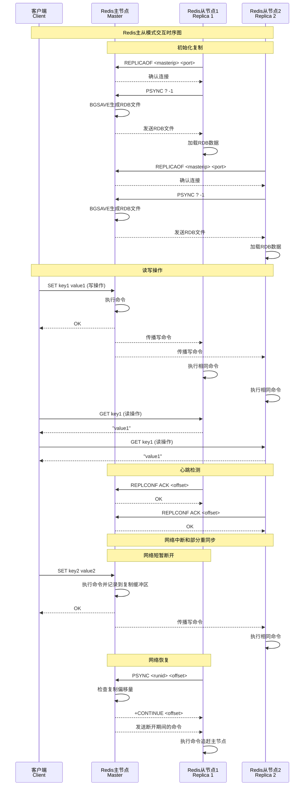

# Redis主从模式

Redis主从模式是一种基本的高可用配置，由一个主节点(Master)和一个或多个从节点(Replica/Slave)组成。主节点处理写操作并将数据变更同步到从节点，从节点主要处理读操作。

## 主从模式特点

- 数据冗余，提高数据安全性
- 读写分离，提高读取性能
- 主节点仍存在单点故障风险
- 不提供自动故障转移功能

## 主从模式架构



## 主从复制工作原理



## 主从复制核心机制详解

### 复制状态管理

Redis主从复制的状态管理是整个复制机制的核心。每个Redis实例都维护着详细的复制状态信息，这些信息决定了节点当前的复制行为和状态。

#### 主要状态字段说明

**连接管理字段**：
- `masterhost`和`masterport`：记录主节点的地址信息，从节点通过这些信息连接主节点
- `master`：指向主节点的客户端连接对象，这是从节点与主节点通信的桥梁
- `repl_state`：当前的复制状态，控制复制过程的状态机转换

**数据传输字段**：
- `repl_transfer_size`：RDB文件的总大小，用于计算传输进度
- `repl_transfer_read`：已经读取的RDB数据量，配合总大小可以显示传输进度
- `repl_transfer_fd`：RDB传输的文件描述符，用于读写RDB文件

**复制积压缓冲区**：
这是Redis实现部分重同步的关键数据结构。它是一个环形缓冲区，主节点将所有写命令都写入这个缓冲区。当从节点断开重连时，如果断开时间不长，可以从这个缓冲区中获取缺失的命令，而不需要进行完整的RDB传输。

**复制ID和偏移量**：
- `replid`：当前的复制ID，用于标识一个复制流
- `master_repl_offset`：主节点的复制偏移量，表示已经处理的命令数量
- 这两个字段配合使用，可以精确定位从节点需要同步的数据位置

### 复制状态转换机制

Redis从节点的连接过程是一个精心设计的状态机，确保连接的可靠性和数据的一致性：

#### 连接建立阶段
1. **REPL_STATE_CONNECT**：从节点准备连接主节点
2. **REPL_STATE_CONNECTING**：正在建立TCP连接
3. **REPL_STATE_RECEIVE_PONG**：发送PING命令测试连接

#### 身份验证阶段
4. **REPL_STATE_SEND_AUTH**：如果配置了密码，发送AUTH命令
5. **REPL_STATE_RECEIVE_AUTH**：等待身份验证结果

#### 信息交换阶段
6. **REPL_STATE_SEND_PORT**：告知主节点自己的监听端口
7. **REPL_STATE_SEND_IP**：告知主节点自己的IP地址
8. **REPL_STATE_SEND_CAPA**：告知主节点自己支持的能力（如PSYNC2、EOF等）

#### 同步阶段
9. **REPL_STATE_SEND_PSYNC**：发送PSYNC命令请求同步
10. **REPL_STATE_RECEIVE_PSYNC**：等待主节点的同步响应
11. **REPL_STATE_TRANSFER**：接收RDB文件或增量数据
12. **REPL_STATE_CONNECTED**：完成同步，进入正常复制状态

这种状态机设计的优势在于：
- **容错性强**：每个状态都有明确的超时和错误处理
- **可观测性好**：可以清楚地知道复制过程进行到哪一步
- **扩展性强**：可以方便地添加新的握手步骤

## 主从复制核心机制实现

### SYNC/PSYNC命令处理机制

当从节点向主节点发送SYNC或PSYNC命令时，主节点需要决定是进行全量同步还是部分同步。这个决策过程是Redis主从复制的核心逻辑。

#### 命令处理流程

**1. 命令识别和验证**
主节点首先检查发送命令的客户端是否已经是从节点，避免重复处理。然后解析命令类型：
- 如果是PSYNC命令，尝试部分重同步
- 如果是SYNC命令或部分重同步失败，进行全量同步

**2. 部分重同步判断**
部分重同步能否成功取决于三个关键条件：
- **复制ID匹配**：从节点提供的复制ID必须与主节点当前或历史复制ID匹配
- **偏移量有效**：从节点请求的偏移量必须在复制积压缓冲区的有效范围内
- **缓冲区存在**：主节点必须有复制积压缓冲区

**3. 全量同步启动**
如果无法进行部分重同步，主节点会：
- 将从节点标记为等待BGSAVE状态
- 检查是否有正在进行的BGSAVE进程，如果有则等待，如果没有则启动新的BGSAVE
- 将从节点添加到从节点列表中

### 部分重同步的实现原理

部分重同步是Redis 2.8引入的重要特性，大大减少了网络断开重连时的数据传输量。

#### 核心组件

**1. 复制积压缓冲区**
这是一个固定大小的环形缓冲区，默认大小为1MB。主节点将所有写命令都写入这个缓冲区，即使没有从节点连接。缓冲区的设计特点：
- **环形结构**：当缓冲区满时，新数据会覆盖最老的数据
- **偏移量跟踪**：每个字节都有对应的全局偏移量
- **历史保持**：保存一定时间内的所有写命令

**2. 复制ID机制**
每个Redis实例都有一个40字节的随机复制ID，用于标识一个复制流：
- 主节点启动时生成新的复制ID
- 从节点升级为主节点时也会生成新的复制ID
- 支持双复制ID，便于故障转移时的部分重同步

**3. 偏移量同步**
主从节点都维护复制偏移量：
- 主节点偏移量：表示已经发送给从节点的数据量
- 从节点偏移量：表示已经接收并处理的数据量
- 通过比较偏移量可以确定从节点缺失的数据

#### 判断逻辑

当从节点发送PSYNC命令时，主节点按以下顺序检查：

1. **复制ID检查**：
   - 如果从节点的复制ID与主节点当前复制ID匹配，继续检查
   - 如果与备用复制ID匹配且偏移量有效，也可以继续
   - 否则需要全量重同步

2. **偏移量检查**：
   - 检查从节点请求的偏移量是否在积压缓冲区范围内
   - 如果偏移量太老（已被覆盖）或太新（超过当前偏移量），需要全量重同步
   - 如果在有效范围内，可以进行部分重同步

3. **数据发送**：
   - 发送"+CONTINUE"响应告知从节点可以部分重同步
   - 从积压缓冲区中提取从请求偏移量到当前偏移量的所有数据
   - 将这些数据发送给从节点

### 命令传播机制

当主节点执行写命令后，需要将这些命令传播给所有从节点，确保数据一致性。

#### 传播过程

**1. 命令格式化**
主节点将执行的命令转换为Redis协议格式：
- 如果涉及不同数据库，先发送SELECT命令
- 将命令参数按照Redis协议格式编码
- 同时写入复制积压缓冲区和发送给从节点

**2. 从节点筛选**
不是所有从节点都会立即接收命令：
- 等待BGSAVE的从节点不接收命令传播
- 只有在线状态的从节点才接收实时命令
- 断开连接的从节点会在重连时通过部分重同步获取缺失命令

**3. 异步发送**
命令传播是异步进行的：
- 主节点不等待从节点确认就继续处理新命令
- 从节点通过输出缓冲区异步接收命令
- 如果从节点处理速度跟不上，可能会被断开连接

#### 优化策略

**1. 批量发送**
Redis会将多个小命令合并成一个网络包发送，减少网络开销。

**2. 缓冲区管理**
每个从节点都有独立的输出缓冲区，避免慢从节点影响其他从节点。

**3. 流量控制**
如果从节点的输出缓冲区过大，主节点会断开连接，避免内存耗尽。

## 主从模式启动流程



## 复制维护和监控机制

### 定时任务管理

Redis通过定时任务来维护主从复制的健康状态，这个任务每秒执行一次，负责多个关键功能。

#### 主要维护任务

**1. 连接状态监控**
定时任务会检查各种连接状态的超时情况：
- **握手超时**：如果从节点在握手过程中超时，会取消握手并重新开始
- **数据传输超时**：如果RDB文件传输过程中长时间没有数据交换，会断开连接
- **心跳超时**：如果主从节点之间长时间没有通信，会断开连接

**2. 从节点管理**
主节点需要管理所有连接的从节点：
- **超时检测**：检查从节点是否及时发送ACK心跳
- **状态更新**：更新从节点的复制状态和统计信息
- **资源清理**：断开超时或异常的从节点连接

**3. 资源优化**
定时任务还负责资源的优化使用：
- **缓冲区管理**：当没有从节点时，可以释放复制积压缓冲区节省内存
- **延迟复制**：对于无盘复制，可以延迟一段时间等待更多从节点连接，提高效率

### 复制积压缓冲区详解

复制积压缓冲区是Redis实现部分重同步的核心数据结构，其设计非常精巧。

#### 环形缓冲区设计

**1. 基本结构**
复制积压缓冲区是一个固定大小的环形缓冲区：
- **固定大小**：默认1MB，可通过配置调整
- **环形结构**：写指针到达末尾时会回到开头，覆盖最老的数据
- **全局偏移量**：每个字节都对应一个全局偏移量，用于精确定位

**2. 关键字段说明**
- `repl_backlog_size`：缓冲区总大小
- `repl_backlog_idx`：当前写入位置
- `repl_backlog_off`：缓冲区中最老数据的偏移量
- `repl_backlog_histlen`：缓冲区中有效数据的长度

**3. 写入机制**
当主节点执行写命令时：
- 命令被格式化为Redis协议格式
- 数据写入环形缓冲区的当前位置
- 更新写入位置和全局偏移量
- 如果缓冲区满了，新数据会覆盖最老的数据

#### 数据读取机制

当从节点请求部分重同步时：

**1. 偏移量验证**
- 检查请求的偏移量是否在缓冲区的有效范围内
- 如果偏移量太老（已被覆盖）或太新（超过当前位置），拒绝部分重同步

**2. 数据定位**
- 根据请求的偏移量计算在缓冲区中的位置
- 考虑环形结构，可能需要从两个不连续的区域读取数据

**3. 数据发送**
- 从计算出的位置开始，发送到当前写入位置的所有数据
- 数据按照Redis协议格式发送给从节点

#### 缓冲区优化策略

**1. 大小配置**
缓冲区大小需要根据实际情况配置：
- 太小：容易导致部分重同步失败，增加全量同步频率
- 太大：占用过多内存，特别是在没有从节点时
- 建议：根据网络断开的典型时长和写入速率来计算

**2. 生命周期管理**
- 当有从节点连接时，保持缓冲区活跃
- 当所有从节点断开后，可以设置超时时间自动释放缓冲区
- 重新有从节点连接时，会重新创建缓冲区

**3. 内存使用监控**
- 缓冲区占用的内存会计入Redis的总内存使用
- 可以通过INFO命令查看缓冲区的使用情况
- 在内存紧张时，可以考虑调整缓冲区大小

## 主从模式交互时序图



## 从节点连接和握手机制

### 连接建立过程

从节点连接主节点是一个复杂的多步骤过程，需要经过连接建立、身份验证、能力协商等多个阶段。

#### 连接初始化

**1. TCP连接建立**
从节点首先需要与主节点建立TCP连接：
- 使用非阻塞连接方式，避免阻塞Redis主线程
- 连接失败时会记录错误日志并稍后重试
- 连接成功后设置相应的事件处理器

**2. 连接状态管理**
连接过程中需要维护多个状态字段：
- `repl_transfer_s`：复制传输连接对象
- `repl_transfer_lastio`：最后一次I/O时间，用于超时检测
- `repl_state`：当前复制状态，控制状态机转换

### 握手状态机详解

从节点与主节点的握手过程是一个精心设计的状态机，确保连接的可靠性和兼容性。

#### 连接验证阶段

**1. PING测试 (REPL_STATE_RECEIVE_PONG)**
- 从节点发送PING命令测试连接是否正常
- 主节点回复PONG表示连接可用
- 如果收到认证错误，说明需要进行身份验证

**2. 身份验证 (REPL_STATE_SEND_AUTH)**
- 如果配置了主节点密码，从节点发送AUTH命令
- 主节点验证密码并返回结果
- 认证失败会导致连接断开

#### 信息交换阶段

**3. 端口信息交换 (REPL_STATE_SEND_PORT)**
从节点告知主节点自己的监听端口：
- 用于主节点记录从节点的网络信息
- 支持从节点公告端口（用于NAT环境）
- 主节点可以通过这个信息连接从节点（如果需要）

**4. IP地址交换 (REPL_STATE_SEND_IP)**
从节点告知主节点自己的IP地址：
- 主节点记录从节点的完整网络地址
- 用于监控和管理从节点
- 支持从节点公告IP（用于复杂网络环境）

**5. 能力协商 (REPL_STATE_SEND_CAPA)**
从节点告知主节点自己支持的特性：
- `eof`：支持无盘复制的EOF标记
- `psync2`：支持PSYNC2协议（更强的部分重同步能力）
- 主节点根据从节点能力选择最优的复制策略

#### 同步请求阶段

**6. PSYNC命令发送 (REPL_STATE_SEND_PSYNC)**
从节点发送PSYNC命令请求同步：
- 首次连接发送`PSYNC ? -1`请求全量同步
- 重连时发送`PSYNC <replid> <offset>`尝试部分重同步
- 主节点根据情况决定同步方式

**7. 同步响应处理 (REPL_STATE_RECEIVE_PSYNC)**
主节点的响应决定后续流程：
- `+FULLRESYNC <replid> <offset>`：需要全量同步
- `+CONTINUE`：可以进行部分重同步
- `+NOMASTERLINK`：主节点也是从节点，无法提供同步

### RDB数据传输过程

当需要全量同步时，从节点需要接收并加载主节点的RDB文件。

#### 文件接收机制

**1. 临时文件创建**
- 从节点创建临时RDB文件用于接收数据
- 文件名包含时间戳和进程ID，避免冲突
- 接收完成后重命名为正式的RDB文件

**2. 数据流式接收**
- 从节点以流式方式接收RDB数据
- 边接收边写入磁盘，避免内存占用过大
- 记录接收进度，支持传输监控

**3. 传输完整性检查**
- 通过文件大小验证传输完整性
- 支持传输过程中的错误恢复
- 传输失败时清理临时文件

#### 数据加载过程

**1. 数据库清空**
在加载新数据前，从节点需要：
- 清空当前所有数据库的数据
- 重置相关统计信息
- 发送数据库清空信号

**2. RDB文件加载**
- 使用专门的复制标志加载RDB文件
- 加载过程中禁止客户端访问
- 加载失败时取消复制握手

**3. 连接状态转换**
数据加载完成后：
- 创建主节点客户端对象
- 转换到已连接状态
- 开始接收实时命令流

### 错误处理和重试机制

**1. 超时处理**
- 每个握手步骤都有超时限制
- 超时后取消当前握手并重新开始
- 记录详细的错误日志便于诊断

**2. 网络错误处理**
- 网络I/O错误会立即中断握手
- 连接断开后会自动重试
- 支持指数退避重试策略

**3. 状态恢复**
- 握手失败后清理所有中间状态
- 重置复制状态为初始值
- 释放相关资源避免内存泄漏

## 主从模式的优缺点

### 优点
1. **读写分离**：提高系统读取性能
2. **数据冗余**：多个副本提高数据安全性
3. **高可用基础**：为Sentinel和集群模式提供基础

### 缺点
1. **主节点单点故障**：主节点故障时无法自动切换
2. **写性能瓶颈**：所有写操作都集中在主节点
3. **全量复制开销**：新从节点加入或断开重连时可能需要全量复制
4. **复制延迟**：从节点数据可能落后于主节点

## RDB文件传输机制详解

Redis支持两种不同的RDB传输方式，每种方式都有其适用场景和优缺点。

### 磁盘复制机制

磁盘复制是Redis的传统复制方式，通过磁盘文件进行数据传输。

#### 工作流程

**1. BGSAVE进程启动**
当需要全量同步时，主节点会启动后台保存进程：
- 创建子进程执行RDB保存，避免阻塞主进程
- 子进程将当前数据库状态保存到RDB文件
- 保存过程中主进程继续处理客户端请求

**2. 文件传输准备**
RDB文件生成完成后：
- 主节点打开RDB文件准备读取
- 为每个等待同步的从节点准备传输
- 设置从节点状态为发送批量数据状态

**3. 数据流式传输**
- 主节点以块的形式读取RDB文件
- 通过网络连接发送给从节点
- 从节点接收数据并写入临时文件

#### 优缺点分析

**优点**：
- **稳定可靠**：经过长期验证的传输方式
- **资源占用低**：主进程内存占用较少
- **支持多从节点**：可以复用同一个RDB文件

**缺点**：
- **磁盘I/O开销**：需要额外的磁盘读写操作
- **存储空间需求**：需要额外的磁盘空间存储RDB文件
- **传输延迟**：需要等待RDB文件生成完成

### 无盘复制机制

无盘复制是Redis 2.8.18引入的新特性，直接通过网络传输数据，无需磁盘文件。

#### 工作原理

**1. 直接网络传输**
- 子进程直接将RDB数据写入从节点的网络连接
- 跳过磁盘文件的中间步骤
- 数据生成和传输同时进行

**2. 多连接并发**
- 支持同时向多个从节点发送数据
- 使用特殊的RIO（Redis I/O）抽象层
- 一次生成，多点传输

**3. 延迟启动机制**
- 可以配置延迟时间等待更多从节点连接
- 在延迟时间内连接的从节点可以共享同一次传输
- 提高传输效率，减少主节点负载

#### 适用场景

**适合无盘复制的情况**：
- 磁盘I/O是瓶颈的环境
- 磁盘空间紧张的系统
- 网络带宽充足的环境
- 从节点数量较多的场景

**不适合无盘复制的情况**：
- 网络不稳定的环境
- 从节点连接时间差异很大
- 对传输可靠性要求极高的场景

### 传输模式选择策略

Redis会根据配置和从节点能力自动选择传输模式：

**1. 配置检查**
- `repl-diskless-sync`：是否启用无盘复制
- `repl-diskless-sync-delay`：无盘复制延迟时间

**2. 从节点能力检查**
- 从节点必须支持EOF能力才能使用无盘复制
- 通过握手阶段的能力协商确定

**3. 动态决策**
- 如果配置允许且从节点支持，优先使用无盘复制
- 否则回退到传统的磁盘复制方式

### 心跳和ACK机制

主从节点之间需要定期交换心跳信息，确保连接状态和数据同步进度。

#### ACK命令机制

**1. 从节点发送ACK**
从节点定期向主节点发送ACK命令：
- 命令格式：`REPLCONF ACK <offset>`
- 包含从节点当前的复制偏移量
- 用于主节点跟踪从节点的同步进度

**2. 主节点处理ACK**
主节点接收到ACK后：
- 更新从节点的最后确认时间
- 记录从节点的复制偏移量
- 用于计算从节点的延迟情况

#### 心跳检测机制

**1. 超时检测**
- 主节点检查从节点的最后ACK时间
- 超过配置的超时时间会断开连接
- 防止僵尸连接占用资源

**2. 延迟监控**
- 通过ACK的偏移量计算从节点延迟
- 延迟过大的从节点可能被标记为不健康
- 用于负载均衡和故障检测

#### REPLCONF命令详解

REPLCONF命令是主从复制中的多功能命令：

**1. 信息交换**
- `listening-port`：从节点监听端口
- `ip-address`：从节点IP地址
- `capa`：从节点支持的能力

**2. 状态同步**
- `ack`：从节点确认接收的数据量
- `getack`：主节点请求从节点发送ACK

**3. 能力协商**
- `eof`：支持无盘复制的EOF标记
- `psync2`：支持增强的部分重同步

这些机制共同确保了Redis主从复制的可靠性和效率，为不同的应用场景提供了灵活的选择。

## 主从模式配置示例

### 主节点配置 (redis-master.conf)
```conf
port 6379
bind 0.0.0.0
daemonize yes
pidfile /var/run/redis_6379.pid
logfile /var/log/redis/redis_6379.log
dir /var/lib/redis
dbfilename dump_6379.rdb
appendonly yes
appendfilename "appendonly_6379.aof"
```

### 从节点配置 (redis-replica.conf)
```conf
port 6380
bind 0.0.0.0
daemonize yes
pidfile /var/run/redis_6380.pid
logfile /var/log/redis/redis_6380.log
dir /var/lib/redis
dbfilename dump_6380.rdb
appendonly yes
appendfilename "appendonly_6380.aof"
replicaof 127.0.0.1 6379  # 指定主节点
replica-read-only yes     # 从节点只读
```

## 主从复制架构总结

### 核心组件交互关系

Redis主从复制涉及多个核心组件的协调工作，形成了一个完整的数据同步生态系统。

#### 主要组件说明

**1. 复制管理器**
负责整个复制过程的协调和管理：
- 维护从节点列表和状态信息
- 处理复制命令和状态转换
- 管理复制积压缓冲区的生命周期

**2. 连接管理器**
处理主从节点之间的网络连接：
- 建立和维护TCP连接
- 处理连接超时和错误恢复
- 管理连接的读写事件

**3. 数据传输器**
负责实际的数据传输工作：
- RDB文件的生成和传输
- 实时命令的传播
- 传输进度的监控和控制

**4. 状态同步器**
维护主从节点的状态一致性：
- 复制偏移量的同步
- 心跳检测和ACK确认
- 故障检测和恢复

### 复制流程的设计哲学

#### 可靠性优先

**1. 多层错误处理**
- 网络层：连接超时、断开重连
- 协议层：命令格式验证、响应确认
- 数据层：传输完整性检查、数据一致性验证

**2. 状态机保证**
- 每个状态都有明确的进入和退出条件
- 异常情况下的状态恢复机制
- 状态转换的原子性保证

#### 性能优化

**1. 异步处理**
- BGSAVE避免阻塞主进程
- 命令传播使用异步I/O
- 心跳检测在后台进行

**2. 资源复用**
- 多个从节点可以共享同一个RDB文件
- 复制积压缓冲区支持多个从节点的部分重同步
- 无盘复制可以同时向多个从节点传输

#### 扩展性考虑

**1. 协议兼容性**
- 支持多个版本的PSYNC协议
- 向后兼容老版本的SYNC命令
- 能力协商机制支持新特性的渐进式部署

**2. 配置灵活性**
- 支持磁盘复制和无盘复制两种模式
- 可配置的超时时间和缓冲区大小
- 支持复杂网络环境的配置选项

### 关键技术创新

#### 部分重同步机制

这是Redis主从复制的重要创新，大大减少了网络断开重连的成本：

**1. 复制ID机制**
- 每个复制流都有唯一的ID标识
- 支持双ID机制，便于故障转移
- ID变化时自动触发全量同步

**2. 偏移量跟踪**
- 精确跟踪每个字节的复制进度
- 支持从任意偏移量开始的增量同步
- 偏移量不匹配时自动降级为全量同步

**3. 环形缓冲区**
- 固定大小的环形结构，内存使用可控
- 自动覆盖最老的数据，保持最新的命令历史
- 支持多个从节点的并发部分重同步

#### 无盘复制技术

针对磁盘I/O瓶颈的优化方案：

**1. 直接网络传输**
- 跳过磁盘文件的中间步骤
- 减少磁盘I/O和存储空间需求
- 提高传输效率，特别是在SSD环境下

**2. 多连接并发**
- 一次生成，多点传输
- 减少主节点的CPU和内存开销
- 提高整体复制效率

### 实际应用建议

#### 配置优化

**1. 复制积压缓冲区大小**
- 根据网络稳定性和写入速率调整
- 一般建议设置为1-10MB
- 网络不稳定的环境可以适当增大

**2. 复制模式选择**
- 磁盘I/O充足：使用磁盘复制
- 磁盘空间紧张：使用无盘复制
- 从节点较多：优先考虑无盘复制

**3. 超时时间设置**
- 根据网络延迟和带宽调整
- 避免过短导致频繁重连
- 避免过长导致故障检测延迟

#### 监控要点

**1. 复制延迟**
- 监控从节点的复制偏移量
- 关注ACK确认的时间间隔
- 设置合理的延迟告警阈值

**2. 连接状态**
- 监控主从连接的稳定性
- 关注重连频率和失败率
- 记录状态转换的异常情况

**3. 资源使用**
- 监控复制积压缓冲区的使用情况
- 关注RDB传输的网络带宽占用
- 监控复制相关的内存使用

Redis主从复制通过精心设计的架构和算法，在保证数据一致性的同时，实现了高性能和高可用性，为Redis的广泛应用奠定了坚实的基础。
