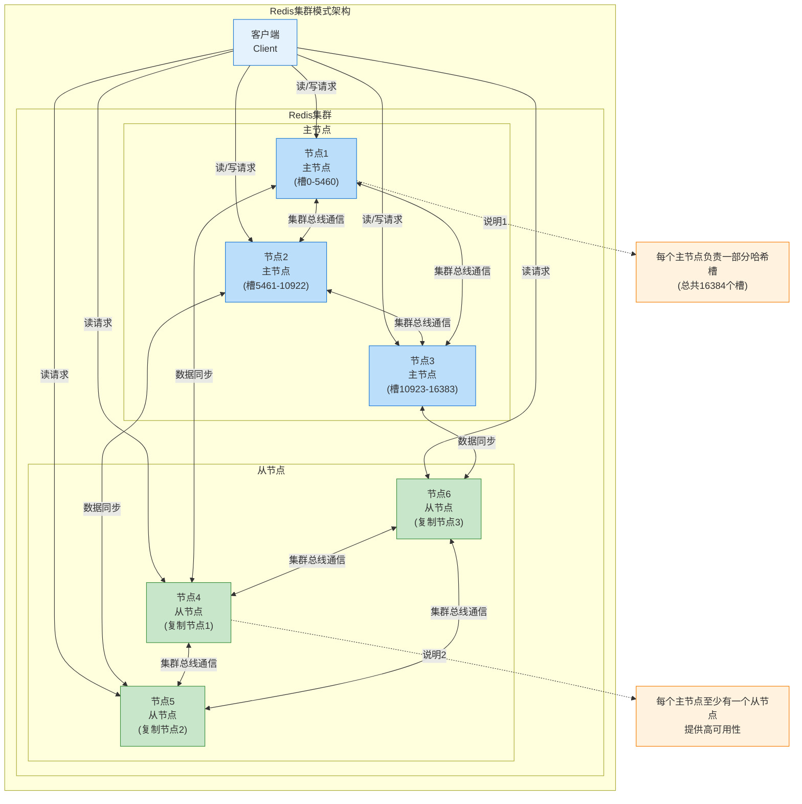
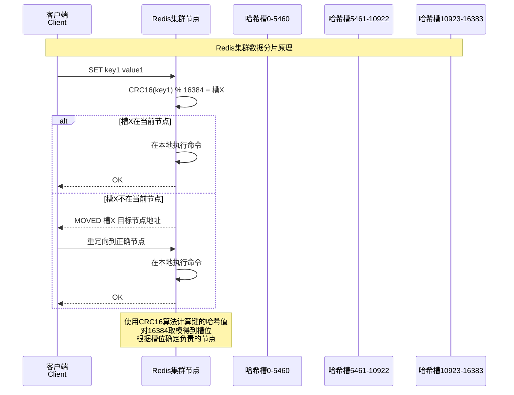
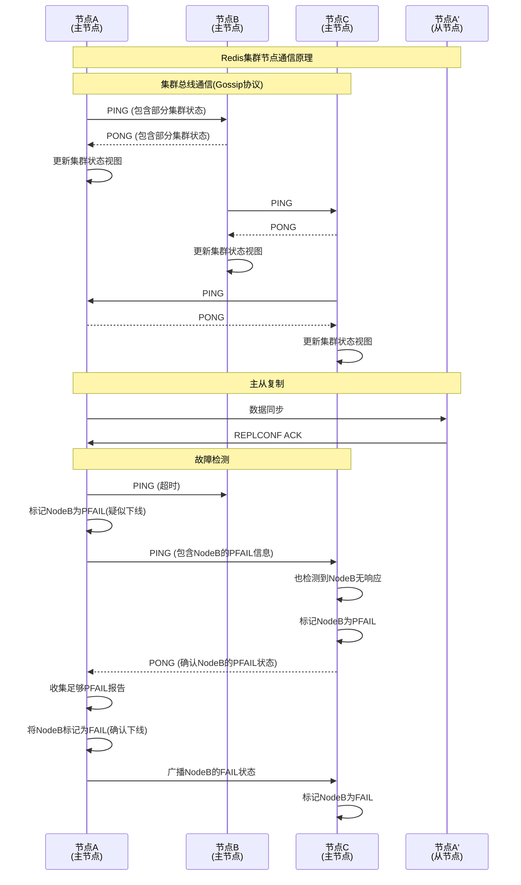
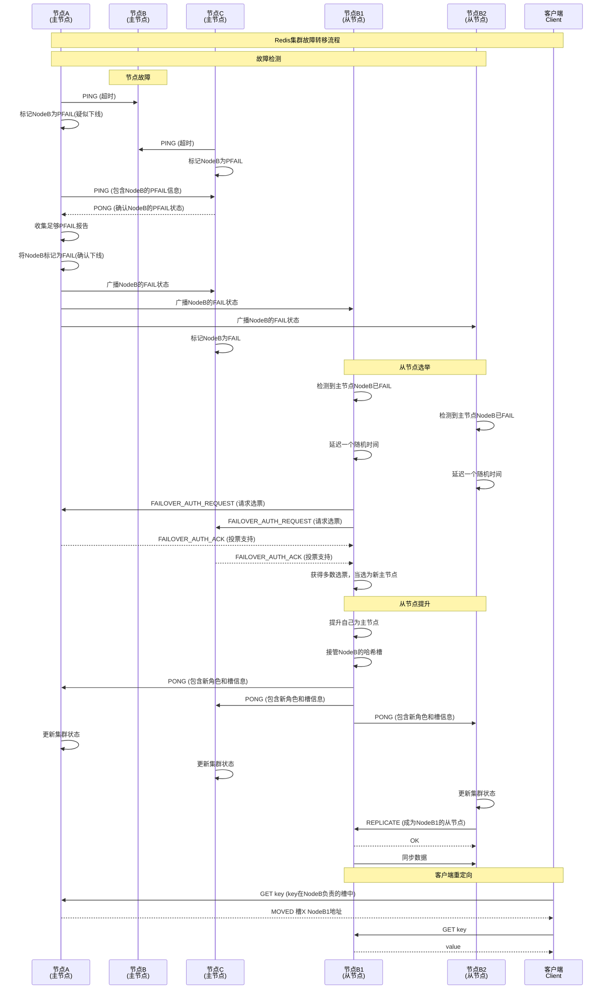
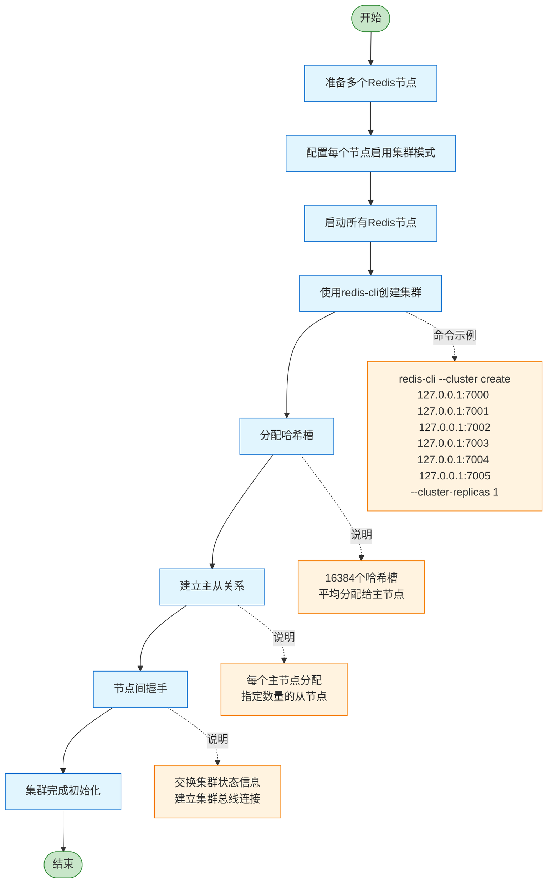

# Redis Cluster模式

Redis集群模式是Redis提供的分布式解决方案，允许数据自动分片到多个节点，并提供一定程度的高可用性和故障转移能力。

## 集群模式特点

- 数据自动分片：数据自动分布到多个节点
- 去中心化：无中心节点，所有节点地位平等
- 高可用性：部分节点故障时集群仍能继续工作
- 自动故障转移：主节点故障时自动选举从节点接管
- 水平扩展：可以动态添加节点扩展集群容量

## 集群模式架构



## 集群数据分片原理



## 集群节点通信原理



## 集群故障转移流程



## 集群模式启动流程



## 集群模式的优缺点

### 优点
1. **水平扩展**：可以通过添加节点来扩展集群容量
2. **高可用性**：主节点故障时自动进行故障转移
3. **分布式存储**：数据自动分片到多个节点
4. **去中心化**：无中心节点，避免单点故障

### 缺点
1. **事务限制**：不支持跨槽的事务操作
2. **数据迁移开销**：节点加入/删除时需要迁移槽和数据
3. **客户端复杂性**：客户端需要处理重定向和集群拓扑变化
4. **一致性保证有限**：在特定场景下可能出现数据不一致

## 集群模式配置示例

### 集群节点配置 (redis-7000.conf)
```conf
port 7000
cluster-enabled yes
cluster-config-file nodes-7000.conf
cluster-node-timeout 5000
appendonly yes
dir ./redis-cluster/7000
daemonize yes
protected-mode no
bind 0.0.0.0
pidfile /var/run/redis_7000.pid
logfile /var/log/redis/redis_7000.log
```

### 集群节点配置 (redis-7001.conf)
```conf
port 7001
cluster-enabled yes
cluster-config-file nodes-7001.conf
cluster-node-timeout 5000
appendonly yes
dir ./redis-cluster/7001
daemonize yes
protected-mode no
bind 0.0.0.0
pidfile /var/run/redis_7001.pid
logfile /var/log/redis/redis_7001.log
```

### 创建集群命令
```bash
redis-cli --cluster create 127.0.0.1:7000 127.0.0.1:7001 127.0.0.1:7002 \
127.0.0.1:7003 127.0.0.1:7004 127.0.0.1:7005 --cluster-replicas 1
```

## 集群常用操作命令

```bash
# 检查集群状态
redis-cli -c -p 7000 cluster info

# 查看集群节点
redis-cli -c -p 7000 cluster nodes

# 查看槽位分配
redis-cli -c -p 7000 cluster slots

# 添加新主节点
redis-cli --cluster add-node 127.0.0.1:7006 127.0.0.1:7000

# 添加从节点
redis-cli --cluster add-node 127.0.0.1:7007 127.0.0.1:7000 --cluster-slave --cluster-master-id <master-node-id>

# 重新分片
redis-cli --cluster reshard 127.0.0.1:7000
```
