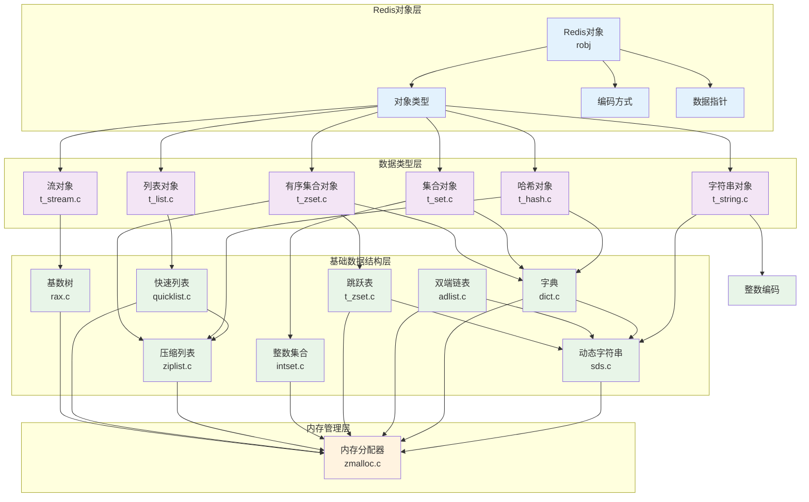
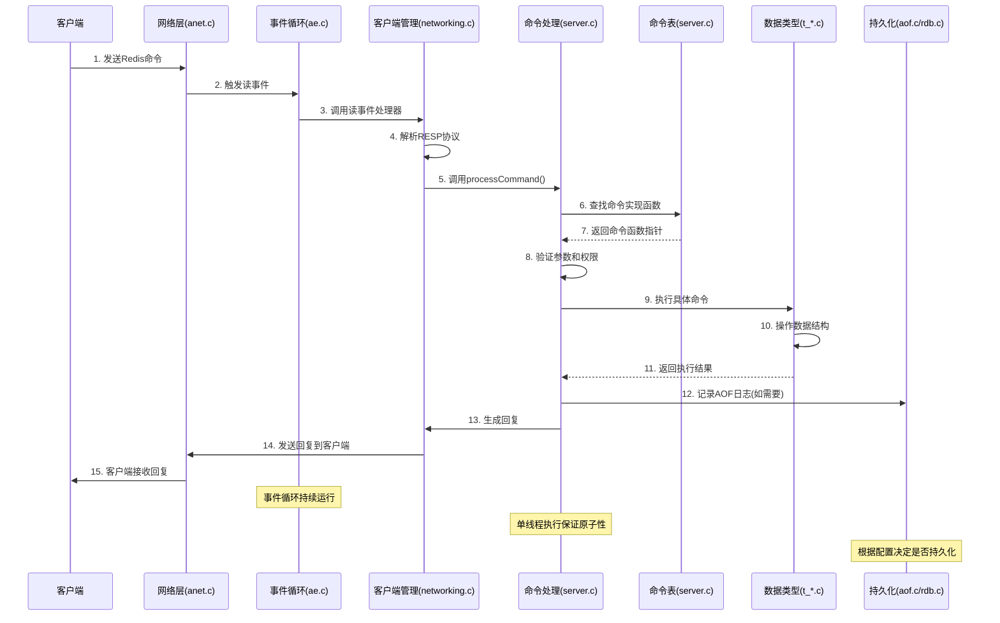
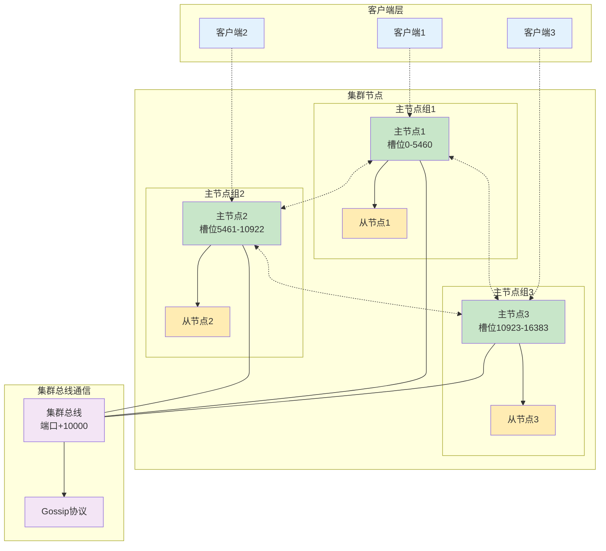
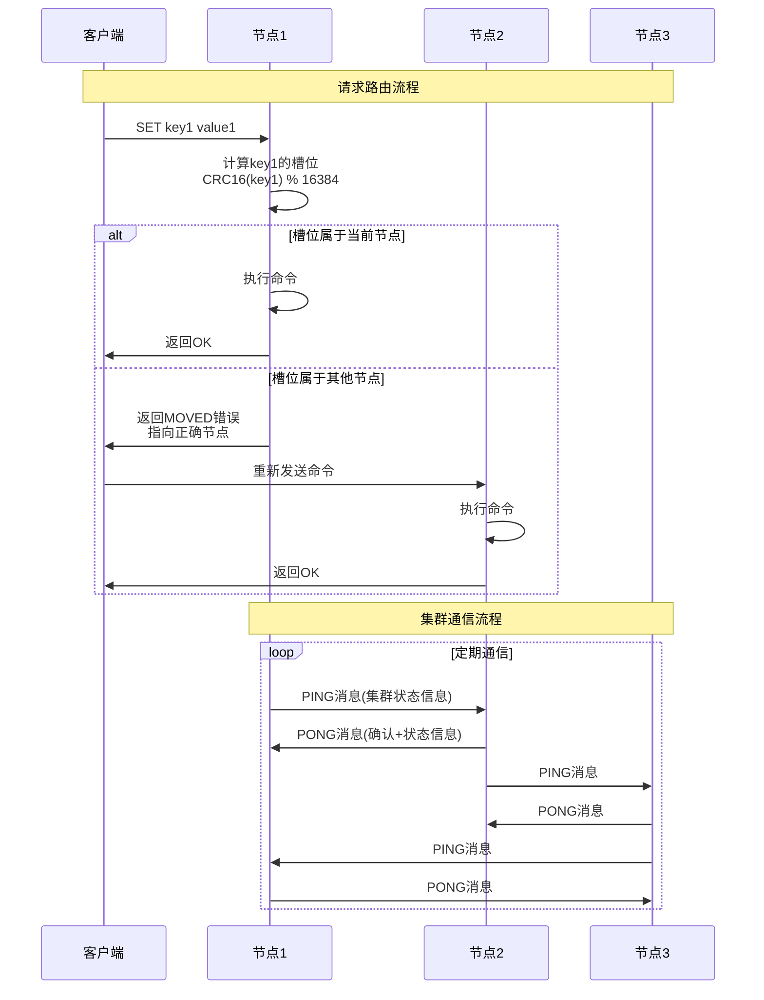
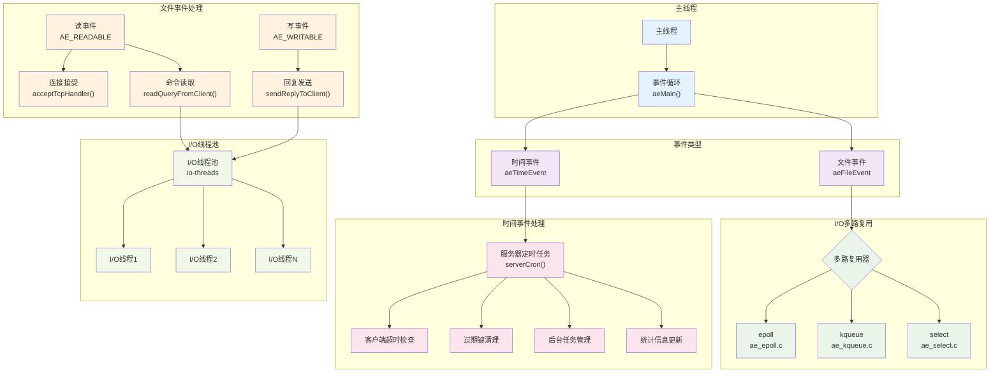

# Redis架构详解

## 1. 概述

Redis是一个开源的内存数据结构存储系统，可以用作数据库、缓存和消息中间件。本文档将详细介绍Redis的整体架构设计，帮助开发者更好地理解Redis的内部工作原理。

## 2. 核心架构组件

Redis的架构可以分为以下几个主要部分：

```mermaid
graph TB
    subgraph CoreServer["核心服务器层"]
        Server["服务器核心<br/>server.c"]
        Config["配置管理<br/>config.c"]
        CommandTable["命令表<br/>server.c"]
    end

    subgraph EventLayer["事件处理层"]
        EventLoop["事件循环<br/>ae.c"]
        FileEvents["文件事件"]
        TimeEvents["时间事件"]
        Multiplexing["多路复用<br/>ae_epoll.c"]
    end

    subgraph NetworkLayer["网络处理层"]
        Anet["网络库<br/>anet.c"]
        Connection["连接管理<br/>connection.c"]
        Networking["客户端管理<br/>networking.c"]
        Protocol["RESP协议解析"]
    end

    subgraph DataLayer["数据存储层"]
        Object["对象系统<br/>object.c"]
        DataTypes["数据类型<br/>t_*.c"]
        DataStructures["基础数据结构<br/>sds.c/dict.c等"]
    end

    subgraph PersistLayer["持久化层"]
        RDB["RDB持久化<br/>rdb.c"]
        AOF["AOF持久化<br/>aof.c"]
    end

    subgraph DistLayer["分布式层"]
        Cluster["集群<br/>cluster.c"]
        Replication["复制<br/>replication.c"]
        Sentinel["哨兵<br/>sentinel.c"]
    end

    subgraph ExtLayer["扩展层"]
        Module["模块系统<br/>module.c"]
        Script["Lua脚本<br/>script.c"]
        PubSub["发布订阅<br/>pubsub.c"]
    end

    %% 连接关系
    Server --> EventLoop
    Server --> CommandTable
    Server --> Config
    EventLoop --> FileEvents
    EventLoop --> TimeEvents
    EventLoop --> Multiplexing
    Networking --> Connection
    Connection --> Anet
    Networking --> Protocol
    Server --> Networking
    Server --> Object
    Object --> DataTypes
    DataTypes --> DataStructures
    Server --> RDB
    Server --> AOF
    Server --> Cluster
    Server --> Replication
    Server --> Module
    Server --> Script
    Server --> PubSub

    %% 样式
    classDef coreLayer fill:#e1f5fe
    classDef eventLayer fill:#f3e5f5
    classDef networkLayer fill:#e8f5e8
    classDef dataLayer fill:#fff3e0
    classDef persistLayer fill:#fce4ec
    classDef distLayer fill:#f1f8e9
    classDef extLayer fill:#fff8e1

    class Server,Config,CommandTable coreLayer
    class EventLoop,FileEvents,TimeEvents,Multiplexing eventLayer
    class Anet,Connection,Networking,Protocol networkLayer
    class Object,DataTypes,DataStructures dataLayer
    class RDB,AOF persistLayer
    class Cluster,Replication,Sentinel distLayer
    class Module,Script,PubSub extLayer
```

### 2.1 核心服务器

核心服务器是Redis的中枢，负责协调各个组件的工作。主要包括：

- **服务器核心(server.c/server.h)**：管理服务器状态、处理命令、管理客户端连接、执行定期任务等
- **配置管理(config.c)**：加载和管理Redis的配置选项
- **命令表(server.c中的commandTable)**：存储所有Redis命令及其实现函数的映射关系

### 2.2 事件处理系统

Redis采用事件驱动模型，通过高效的事件处理机制来处理客户端请求和定时任务：

- **事件循环(ae.c)**：Redis的核心事件处理循环，负责调度和分发各种事件
- **文件事件**：处理客户端连接、命令请求等I/O事件
- **时间事件**：处理定时任务，如过期键清理、统计信息更新等
- **多路复用API**：支持多种I/O多路复用技术(epoll、kqueue、select等)，根据平台自动选择最优方案

### 2.3 网络处理

负责处理客户端连接和网络通信：

- **网络库(anet.c)**：封装了底层网络操作，提供简单易用的API
- **连接管理(connection.c)**：管理客户端连接的创建、维护和关闭
- **客户端管理(networking.c)**：处理客户端状态、命令解析和回复生成
- **协议解析(networking.c)**：解析RESP(Redis序列化协议)格式的命令

### 2.4 基础数据结构

Redis实现了多种高效的数据结构，作为其各种功能的基础：

- **动态字符串(sds.c)**：高效的字符串处理库，支持动态扩容
- **双端链表(adlist.c)**：双向链表实现，用于列表类型和内部数据结构
- **字典(dict.c)**：哈希表实现，支持渐进式rehash，是Redis的核心数据结构
- **跳跃表(t_zset.c中的zskiplist)**：用于有序集合的实现
- **整数集合(intset.c)**：紧凑的整数集合实现
- **压缩列表(ziplist.c)**：内存高效的双向链表实现

### 2.5 Redis数据类型

Redis支持多种数据类型，每种类型都有特定的实现和命令：

- **对象系统(object.c)**：统一的对象管理系统，处理引用计数和内存回收
- **字符串(t_string.c)**：实现字符串类型及其命令
- **列表(t_list.c)**：实现列表类型及其命令
- **哈希(t_hash.c)**：实现哈希类型及其命令
- **集合(t_set.c)**：实现集合类型及其命令
- **有序集合(t_zset.c)**：实现有序集合类型及其命令
- **流(t_stream.c)**：实现流类型及其命令

### 2.6 持久化

Redis提供多种持久化机制，确保数据在重启后不丢失：

- **RDB持久化(rdb.c)**：通过快照将数据保存到磁盘
- **AOF持久化(aof.c)**：记录所有修改数据的命令
- **混合持久化**：结合RDB和AOF的优点，提供更高效的持久化方案

### 2.7 集群

Redis集群提供了分布式数据存储和高可用性：

- **集群管理(cluster.c)**：处理集群配置、状态维护和命令路由
- **节点管理**：管理集群中的节点信息和状态
- **槽位管理**：处理数据分片和槽位分配
- **消息处理**：处理节点间通信和消息传递

### 2.8 复制

Redis支持主从复制，实现数据备份和读写分离：

- **主从复制(replication.c)**：实现主节点到从节点的数据同步
- **复制缓冲区**：用于部分重同步，减少全量同步的次数

### 2.9 哨兵

Redis哨兵提供高可用性解决方案：

- **哨兵核心(sentinel.c)**：监控Redis实例，处理故障检测和转移
- **实例监控**：监控主从节点的状态
- **故障转移**：在主节点故障时自动选举新的主节点

### 2.10 模块系统

Redis模块系统允许开发者扩展Redis功能：

- **模块API(module.c)**：提供模块加载和管理的接口
- **命令注册**：允许模块注册自定义命令
- **数据类型**：支持模块定义新的数据类型

### 2.11 其他组件

Redis还包含多个辅助组件：

- **事务(multi.c)**：提供ACID特性的事务支持
- **发布订阅(pubsub.c)**：实现消息发布和订阅功能
- **Lua脚本(script.c)**：支持服务端Lua脚本执行
- **慢查询日志(slowlog.c)**：记录执行时间较长的命令
- **内存管理(zmalloc.c)**：自定义内存分配器，提高内存使用效率

## 3. 数据流程

### 3.1 命令执行流程

详细流程说明：

1. **客户端发送命令到服务器** - 通过TCP连接发送RESP格式的命令
2. **服务器接收并解析命令** - 网络层接收数据，事件循环分发到相应处理器
3. **查找命令表，获取命令实现函数** - 在全局命令表中查找对应的处理函数
4. **执行命令，操作相应的数据结构** - 调用具体的命令实现函数
5. **生成回复并发送给客户端** - 格式化结果为RESP协议并发送
6. **根据需要进行持久化操作** - 写入AOF日志或触发RDB快照

### 3.2 数据持久化流程

```mermaid
graph TB
    subgraph RDBFlow["RDB持久化流程"]
        RDBTrigger["触发条件"]
        SaveConfig["定时保存"]
        SaveCmd["同步保存"]
        BgSaveCmd["异步保存"]
        RDBSync["同步RDB生成<br/>rdbSave()"]
        RDBAsync["异步RDB生成<br/>rdbSaveBackground()"]
        Fork["fork()子进程"]
        ChildProcess["子进程执行"]
        TraverseDB["遍历数据库"]
        WriteRDB["写入RDB文件"]
        ReplaceFile["替换旧文件"]

        RDBTrigger --> SaveConfig
        RDBTrigger --> SaveCmd
        RDBTrigger --> BgSaveCmd
        SaveCmd --> RDBSync
        BgSaveCmd --> RDBAsync
        SaveConfig --> RDBAsync
        RDBAsync --> Fork
        Fork --> ChildProcess
        ChildProcess --> TraverseDB
        TraverseDB --> WriteRDB
        WriteRDB --> ReplaceFile
        RDBSync --> TraverseDB
    end

    subgraph AOFFlow["AOF持久化流程"]
        Command["执行写命令"]
        AOFBuffer["追加到AOF缓冲区<br/>server.aof_buf"]
        FlushStrategy{"刷盘策略<br/>appendfsync"}
        SyncWrite["同步写入磁盘"]
        AsyncWrite["异步写入磁盘<br/>每秒一次"]
        OSBuffer["交给操作系统"]
        AOFFile["AOF文件"]
        AOFRewrite["AOF重写"]
        RewriteProcess["重写进程"]
        NewAOF["生成新AOF文件"]
        ReplaceAOF["替换旧AOF文件"]

        Command --> AOFBuffer
        AOFBuffer --> FlushStrategy
        FlushStrategy --> SyncWrite
        FlushStrategy --> AsyncWrite
        FlushStrategy --> OSBuffer
        SyncWrite --> AOFFile
        AsyncWrite --> AOFFile
        OSBuffer --> AOFFile
        AOFFile --> AOFRewrite
        AOFRewrite --> RewriteProcess
        RewriteProcess --> NewAOF
        NewAOF --> ReplaceAOF
    end

    subgraph MixedFlow["混合持久化"]
        MixedMode["混合持久化模式"]
        RDBSnapshot["RDB快照数据"]
        AOFIncremental["AOF增量数据"]
        MixedFile["混合持久化文件"]

        MixedMode --> RDBSnapshot
        MixedMode --> AOFIncremental
        RDBSnapshot --> MixedFile
        AOFIncremental --> MixedFile
    end

    %% 样式
    classDef rdbStyle fill:#e3f2fd
    classDef aofStyle fill:#f3e5f5
    classDef mixedStyle fill:#e8f5e8

    class RDBTrigger,SaveConfig,SaveCmd,BgSaveCmd,RDBSync,RDBAsync,Fork,ChildProcess,TraverseDB,WriteRDB,ReplaceFile rdbStyle
    class Command,AOFBuffer,FlushStrategy,SyncWrite,AsyncWrite,OSBuffer,AOFFile,AOFRewrite,RewriteProcess,NewAOF,ReplaceAOF aofStyle
    class MixedMode,RDBSnapshot,AOFIncremental,MixedFile mixedStyle
```

#### RDB持久化详细说明：
1. **触发条件满足**(如save配置、SAVE/BGSAVE命令) - 在`server.c`的`serverCron()`中检查
2. **创建子进程**(BGSAVE)或在当前进程(SAVE)中执行 - 调用`rdb.c`中的相应函数
3. **遍历数据库中的键值对，生成RDB文件** - 序列化所有数据到二进制格式
4. **完成后替换旧的RDB文件** - 原子性地替换文件

#### AOF持久化详细说明：
1. **执行修改数据的命令** - 在`server.c`的`call()`函数中处理
2. **将命令追加到AOF缓冲区** - 存储在`server.aof_buf`中
3. **根据appendfsync策略将缓冲区数据写入磁盘** - 在`aof.c`中实现不同策略
4. **当AOF文件过大时，触发AOF重写** - 通过`rewriteAppendOnlyFileBackground()`实现

### 3.3 集群操作流程

#### 请求路由详细说明：
1. **客户端发送命令到任意节点** - 客户端可以连接集群中的任何节点
2. **节点计算命令涉及的键所在的槽位** - 使用CRC16算法：`CRC16(key) % 16384`
3. **如果槽位由当前节点负责，则执行命令** - 在`cluster.c`的`clusterRedirectClient()`中判断
4. **否则，返回MOVED错误，指引客户端重定向到正确的节点** - 返回目标节点的IP和端口

#### 集群通信详细说明：
1. **节点间通过Gossip协议交换信息** - 在`cluster.c`中实现
2. **每个节点定期向其他节点发送PING消息** - 包含节点状态、槽位分配等信息
3. **接收到PING的节点回复PONG消息** - 确认收到并返回自己的状态信息
4. **通过这些消息交换集群状态信息** - 实现最终一致性的集群状态同步

## 4. 关键技术

### 4.1 内存管理

Redis作为内存数据库，高效的内存管理至关重要：

```mermaid
graph TB
    subgraph AllocLayer["内存分配层"]
        ZMalloc["自定义分配器<br/>zmalloc.c"]
        SystemMalloc{"系统分配器"}
        LibcMalloc["libc malloc"]
        Jemalloc["jemalloc"]
        TCMalloc["tcmalloc"]

        ZMalloc --> SystemMalloc
        SystemMalloc --> LibcMalloc
        SystemMalloc --> Jemalloc
        SystemMalloc --> TCMalloc
    end

    subgraph ObjectLayer["对象管理层"]
        ObjectPool["对象池"]
        RefCount["引用计数"]
        ObjectSharing["对象共享"]
        SharedIntegers["共享整数对象<br/>0-9999"]
        SharedStrings["共享字符串对象"]

        ObjectPool --> SharedIntegers
        ObjectSharing --> SharedStrings
    end

    subgraph EncodeLayer["编码优化层"]
        EncodingOpt["编码优化"]
        StringEnc["字符串编码优化"]
        ListEnc["列表编码优化"]
        HashEnc["哈希编码优化"]
        SetEnc["集合编码优化"]
        ZSetEnc["有序集合编码优化"]
        IntEncoding["整数编码"]
        EmbstrEncoding["嵌入式字符串"]
        ZipListEnc["压缩列表编码"]
        QuickListEnc["快速列表编码"]
        ZipListHashEnc["压缩列表编码"]
        DictHashEnc["字典编码"]
        IntSetEnc["整数集合编码"]
        DictSetEnc["字典编码"]
        ZipListZSetEnc["压缩列表编码"]
        SkipListEnc["跳跃表编码"]

        EncodingOpt --> StringEnc
        EncodingOpt --> ListEnc
        EncodingOpt --> HashEnc
        EncodingOpt --> SetEnc
        EncodingOpt --> ZSetEnc
        StringEnc --> IntEncoding
        StringEnc --> EmbstrEncoding
        ListEnc --> ZipListEnc
        ListEnc --> QuickListEnc
        HashEnc --> ZipListHashEnc
        HashEnc --> DictHashEnc
        SetEnc --> IntSetEnc
        SetEnc --> DictSetEnc
        ZSetEnc --> ZipListZSetEnc
        ZSetEnc --> SkipListEnc
    end

    subgraph ExpireLayer["过期键管理"]
        ExpireStrategy["过期策略"]
        LazyExpire["惰性删除<br/>访问时检查"]
        PeriodicExpire["定期删除<br/>serverCron()"]
        ActiveExpire["主动删除<br/>activeExpireCycle()"]

        ExpireStrategy --> LazyExpire
        ExpireStrategy --> PeriodicExpire
        ExpireStrategy --> ActiveExpire
    end

    subgraph EvictLayer["内存回收"]
        MemoryEviction["内存淘汰"]
        NoEviction["noeviction<br/>不淘汰"]
        AllKeysLRU["allkeys-lru<br/>LRU淘汰所有键"]
        VolatileLRU["volatile-lru<br/>LRU淘汰过期键"]
        AllKeysLFU["allkeys-lfu<br/>LFU淘汰所有键"]
        VolatileLFU["volatile-lfu<br/>LFU淘汰过期键"]
        AllKeysRandom["allkeys-random<br/>随机淘汰所有键"]
        VolatileRandom["volatile-random<br/>随机淘汰过期键"]
        VolatileTTL["volatile-ttl<br/>淘汰最早过期的键"]

        MemoryEviction --> NoEviction
        MemoryEviction --> AllKeysLRU
        MemoryEviction --> VolatileLRU
        MemoryEviction --> AllKeysLFU
        MemoryEviction --> VolatileLFU
        MemoryEviction --> AllKeysRandom
        MemoryEviction --> VolatileRandom
        MemoryEviction --> VolatileTTL
    end

    %% 连接关系
    ZMalloc --> ObjectPool
    ObjectPool --> RefCount
    RefCount --> ObjectSharing
    ObjectSharing --> EncodingOpt
    EncodingOpt --> ExpireStrategy
    ExpireStrategy --> MemoryEviction

    %% 样式
    classDef allocStyle fill:#e3f2fd
    classDef objectStyle fill:#f3e5f5
    classDef encodeStyle fill:#e8f5e8
    classDef expireStyle fill:#fff3e0
    classDef evictStyle fill:#fce4ec

    class ZMalloc,SystemMalloc,LibcMalloc,Jemalloc,TCMalloc allocStyle
    class ObjectPool,RefCount,ObjectSharing,SharedIntegers,SharedStrings objectStyle
    class EncodingOpt,StringEnc,ListEnc,HashEnc,SetEnc,ZSetEnc,IntEncoding,EmbstrEncoding,ZipListEnc,QuickListEnc,ZipListHashEnc,DictHashEnc,IntSetEnc,DictSetEnc,ZipListZSetEnc,SkipListEnc encodeStyle
    class ExpireStrategy,LazyExpire,PeriodicExpire,ActiveExpire expireStyle
    class MemoryEviction,NoEviction,AllKeysLRU,VolatileLRU,AllKeysLFU,VolatileLFU,AllKeysRandom,VolatileRandom,VolatileTTL evictStyle
```

- **自定义内存分配器，减少内存碎片** - `zmalloc.c`封装系统分配器，提供统一接口
- **对象共享机制，减少内存使用** - 小整数和常用字符串使用共享对象
- **多种数据结构编码方式，根据数据特点选择最节省内存的编码** - 如压缩列表、整数集合等
- **惰性删除和定期删除相结合的过期键处理策略** - 在`expire.c`中实现多种过期策略

### 4.2 高性能I/O

Redis的高性能得益于其高效的I/O处理：

- **基于事件驱动的非阻塞I/O模型** - 使用`ae.c`实现的事件循环
- **多路复用技术，高效处理大量并发连接** - 根据平台选择最优的多路复用API
- **单线程处理命令，避免了锁和线程切换开销** - 主线程串行处理所有命令
- **I/O线程池处理耗时的I/O操作** - Redis 6.0引入的多线程I/O优化

### 4.3 数据结构优化

Redis针对不同场景优化了多种数据结构：

- 压缩列表和整数集合等紧凑数据结构，减少内存使用
- 跳跃表实现的有序集合，提供高效的范围查询
- 渐进式rehash的字典实现，避免大字典rehash时的性能抖动

## 5. 总结

Redis通过精心设计的架构和高效的实现，提供了卓越的性能和丰富的功能。其模块化的设计使得各个组件可以独立工作，同时又能协同配合，形成一个完整的系统。理解Redis的架构设计，有助于更好地使用Redis，并在必要时进行定制和扩展。

Redis的成功不仅在于其性能，还在于其简洁而强大的设计理念。通过专注于做好一件事——高性能的内存数据结构存储，Redis在众多数据库和缓存系统中脱颖而出，成为现代应用架构中不可或缺的组件。
